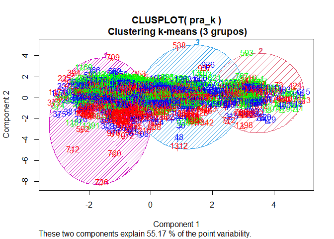
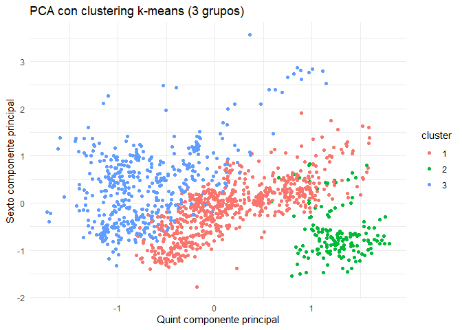
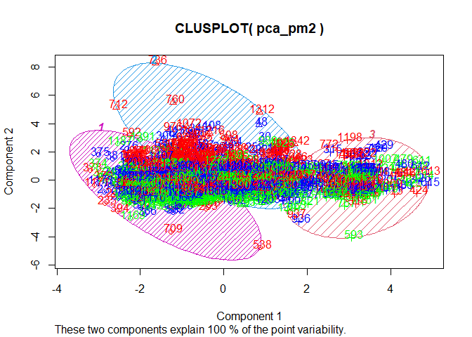

International expansion of N&D holdings II
================
Anton Barrera Mora (<me@antonio-barrera.cyou>)
July 2023

Continue loading the first part of the project final dataset.

# Phase 3: Data Preparation

Preparing dataset to work with different analysis models, so in its
current state, derived from phase 2, it still requires some adjustments
to make it as suitable as possible.

``` r
# Cargamos el dataset
pra2 <- read.csv("pra1.csv", header=T,sep = ",")#cargamos el fichero especificando el separador
attach(pra2) # Agregamos el fichero al entorno de trabajo para poder llamar a las variables mas facilmente, aunque este metodo tiene varios problemas, vamos a emplearlo con cuidado y a respetar las buenas practicas al incluir la ruta completa siempre que sea necesario
```

``` r
# Análisis del conjunto de datos
glimpse(pra2)
```

    ## Rows: 1,408
    ## Columns: 52
    ## $ X                 <int> 1, 2, 3, 4, 5, 6, 7, 8, 9, 10, 11, 12, 13, 14, 15, 1…
    ## $ entity            <chr> "Aruba", "Aruba", "Aruba", "Aruba", "Aruba", "Aruba"…
    ## $ code              <chr> "ABW", "ABW", "ABW", "ABW", "ABW", "ABW", "AFG", "AF…
    ## $ year              <int> 2015, 2016, 2017, 2018, 2019, 2020, 2015, 2016, 2017…
    ## $ gdp_index         <dbl> 5.12965727, 1.58786881, 1.51982141, 0.68640423, -0.1…
    ## $ imf_index         <dbl> 28.51431, 28.45803, 27.92962, 27.65600, 27.46546, 28…
    ## $ uhc_index         <dbl> 40.83718, 40.83718, 40.83718, 40.83718, 40.83718, 40…
    ## $ bci_index         <dbl> 45, 45, 45, 45, 45, 45, 45, 45, 45, 45, 45, 45, 45, …
    ## $ ilo_index         <dbl> 3.74, 3.67, 3.63, 3.59, 3.62, 3.55, 5.18, 5.50, 5.41…
    ## $ phy_index         <dbl> 0.3214649, 0.3214649, 0.3214649, 0.3214649, 0.321464…
    ## $ u_1               <int> 1139, 1113, 1085, 1055, 1020, 927, 1238201, 1256664,…
    ## $ u_5               <int> 6026, 5919, 5792, 5664, 5525, 5288, 5747862, 5894636…
    ## $ u_15              <int> 19599, 19480, 19334, 19150, 18912, 18494, 15456437, …
    ## $ u_25              <int> 32827, 32411, 31974, 31568, 31226, 30935, 22708012, …
    ## $ btn_15_64         <int> 72312, 72397, 72421, 72402, 72349, 72176, 17485012, …
    ## $ old_15            <int> 84669, 85409, 86119, 86829, 87545, 88102, 18296928, …
    ## $ old_18            <int> 80750, 81518, 82173, 82780, 83380, 83857, 15818155, …
    ## $ at_1              <int> 1170, 1146, 1120, 1093, 1063, 1023, 1187761, 1216903…
    ## $ btn_1_4           <int> 4887, 4806, 4707, 4609, 4505, 4361, 4509661, 4637972…
    ## $ btn_5_9           <int> 6677, 6625, 6571, 6501, 6421, 6301, 5083265, 5142552…
    ## $ btn_10_14         <int> 6896, 6936, 6971, 6985, 6966, 6905, 4625310, 4729549…
    ## $ btn_15_19         <int> 6533, 6389, 6373, 6468, 6654, 6859, 3998778, 4102738…
    ## $ btn_20_29         <int> 12811, 12851, 12711, 12419, 12019, 11749, 5732466, 5…
    ## $ btn_30_39         <int> 13038, 13061, 13150, 13291, 13464, 13506, 3529267, 3…
    ## $ btn_40_49         <int> 15979, 15688, 15433, 15224, 15049, 14846, 2350849, 2…
    ## $ btn_50_59         <int> 17286, 17443, 17502, 17487, 17410, 17260, 1413659, 1…
    ## $ btn_60_69         <int> 11532, 12134, 12730, 13309, 13871, 14349, 814056, 83…
    ## $ btn_70_79         <int> 5707, 5933, 6187, 6483, 6808, 7152, 371848, 385801, …
    ## $ btn_80_89         <int> 1667, 1791, 1910, 2016, 2119, 2213, 81378, 83944, 87…
    ## $ btn_90_99         <int> 116, 119, 123, 132, 151, 168, 4628, 4140, 4236, 4513…
    ## $ old_100           <int> 1, 1, 1, 1, 1, 1, 133, 72, 40, 23, 14, 32, 182, 184,…
    ## $ population        <int> 104269, 104890, 105454, 105980, 106458, 106597, 3375…
    ## $ region            <chr> "Caribe", "Caribe", "Caribe", "Caribe", "Caribe", "C…
    ## $ region_gdp        <chr> "LAC", "LAC", "LAC", "LAC", "LAC", "LAC", "EAP", "EA…
    ## $ entity_global_gdp <chr> "Latin America and Caribbean", "Latin America and Ca…
    ## $ gdp_global        <dbl> -0.4736689, -1.1364956, 0.9009982, 0.6864042, -0.129…
    ## $ region_imf        <chr> "LAC", "LAC", "LAC", "LAC", "LAC", "LAC", "SAS", "SA…
    ## $ entity_global_imf <chr> "Latin America and Caribbean", "Latin America and Ca…
    ## $ imf_global        <dbl> 28.51431, 28.45803, 27.92962, 27.65600, 27.46546, 28…
    ## $ region_uhc        <chr> "LWC", "LWC", "LWC", "LWC", "LWC", "LWC", "ASI", "AS…
    ## $ entity_global_uhc <chr> "Low-income", "Low income", "Low-income", "Low incom…
    ## $ region_bci        <chr> "No OCDE", "No OCDE", "No OCDE", "No OCDE", "No OCDE…
    ## $ region_ilo        <chr> "SID", "SID", "SID", "SID", "SID", "SID", "CSA", "CS…
    ## $ entity_global_ilo <chr> "Small island developing states (SIDS)", "Small isla…
    ## $ ilo_global        <dbl> 3.74, 3.67, 3.63, 3.59, 3.62, 3.55, 5.18, 5.50, 5.41…
    ## $ region_phy        <chr> "LWC", "LWC", "LWC", "LWC", "LWC", "LWC", "EAP", "EA…
    ## $ entity_global_phy <chr> "Low-income", "Low income", "Low-income", "Low incom…
    ## $ phy_global        <dbl> 0.3214649, 0.3214649, 0.3214649, 0.3214649, 0.321464…
    ## $ opep              <int> 0, 0, 0, 0, 0, 0, 0, 0, 0, 0, 0, 0, 1, 1, 1, 1, 1, 1…
    ## $ kyoto             <int> 1, 1, 1, 1, 1, 1, 1, 1, 1, 1, 1, 1, 1, 1, 1, 1, 1, 1…
    ## $ ocde              <int> 0, 0, 0, 0, 0, 0, 0, 0, 0, 0, 0, 0, 0, 0, 0, 0, 0, 0…
    ## $ war               <int> 0, 0, 0, 0, 0, 0, 1, 1, 1, 1, 1, 1, 0, 0, 0, 0, 0, 0…

Let’s recheck for infinite values using the summary() function:

``` r
#Buscamos valores infinitos
summary(pra2)
```

    ##        X             entity              code                year     
    ##  Min.   :   1.0   Length:1408        Length:1408        Min.   :2015  
    ##  1st Qu.: 352.8   Class :character   Class :character   1st Qu.:2016  
    ##  Median : 704.5   Mode  :character   Mode  :character   Median :2018  
    ##  Mean   : 704.5                                         Mean   :2018  
    ##  3rd Qu.:1056.2                                         3rd Qu.:2019  
    ##  Max.   :1408.0                                         Max.   :2020  
    ##    gdp_index          imf_index       uhc_index       bci_index    
    ##  Min.   :-54.6414   Min.   : 0.00   Min.   :17.04   Min.   : 45.0  
    ##  1st Qu.: -1.1365   1st Qu.:16.47   1st Qu.:46.97   1st Qu.: 45.0  
    ##  Median :  1.1536   Median :24.59   Median :65.52   Median : 45.0  
    ##  Mean   :  0.2936   Mean   :24.69   Mean   :60.31   Mean   : 51.4  
    ##  3rd Qu.:  3.0182   3rd Qu.:29.92   3rd Qu.:73.81   3rd Qu.: 45.0  
    ##  Max.   : 42.7893   Max.   :93.33   Max.   :89.36   Max.   :102.2  
    ##    ilo_index        phy_index           u_1                u_5           
    ##  Min.   : 0.000   Min.   :0.0000   Min.   :      25   Min.   :      137  
    ##  1st Qu.: 1.020   1st Qu.:0.4405   1st Qu.:    6663   1st Qu.:    32820  
    ##  Median : 1.830   Median :1.6820   Median :   82421   Median :   410146  
    ##  Mean   : 2.927   Mean   :1.9719   Mean   :  596397   Mean   :  2981534  
    ##  3rd Qu.: 4.670   3rd Qu.:2.9807   3rd Qu.:  430672   3rd Qu.:  2231643  
    ##  Max.   :10.000   Max.   :8.4199   Max.   :24119940   Max.   :123077610  
    ##       u_15                u_25             btn_15_64        
    ##  Min.   :      443   Min.   :      662   Min.   :      853  
    ##  1st Qu.:    93924   1st Qu.:   164148   1st Qu.:   255625  
    ##  Median :  1133286   Median :  1888162   Median :  3500884  
    ##  Mean   :  8659744   Mean   : 13925101   Mean   : 21733820  
    ##  3rd Qu.:  6819424   3rd Qu.: 10566138   3rd Qu.: 12706830  
    ##  Max.   :378793180   Max.   :625572740   Max.   :998226100  
    ##      old_15              old_18               at_1             btn_1_4        
    ##  Min.   :1.004e+03   Min.   :9.270e+02   Min.   :      26   Min.   :     101  
    ##  1st Qu.:3.168e+05   1st Qu.:2.985e+05   1st Qu.:    6577   1st Qu.:   26370  
    ##  Median :4.183e+06   Median :3.878e+06   Median :   82667   Median :  327168  
    ##  Mean   :2.475e+07   Mean   :2.314e+07   Mean   :  596451   Mean   : 2385138  
    ##  3rd Qu.:1.452e+07   3rd Qu.:1.336e+07   3rd Qu.:  430034   3rd Qu.: 1812960  
    ##  Max.   :1.168e+09   Max.   :1.121e+09   Max.   :24310256   Max.   :98957660  
    ##     btn_5_9            btn_10_14           btn_15_19        
    ##  Min.   :      157   Min.   :      145   Min.   :      119  
    ##  1st Qu.:    31334   1st Qu.:    30904   1st Qu.:    30220  
    ##  Median :   383236   Median :   367230   Median :   381150  
    ##  Mean   :  2910507   Mean   :  2767703   Mean   :  2656978  
    ##  3rd Qu.:  2297924   3rd Qu.:  2044114   3rd Qu.:  1895012  
    ##  Max.   :126093064   Max.   :129622510   Max.   :129072030  
    ##    btn_20_29           btn_30_39           btn_40_49        
    ##  Min.   :      173   Min.   :      165   Min.   :      169  
    ##  1st Qu.:    67753   1st Qu.:    58366   1st Qu.:    54846  
    ##  Median :   838490   Median :   820324   Median :   664292  
    ##  Mean   :  5255392   Mean   :  4818009   Mean   :  4180757  
    ##  3rd Qu.:  3261191   3rd Qu.:  2915196   3rd Qu.:  2187945  
    ##  Max.   :244835570   Max.   :226808160   Max.   :239132460  
    ##    btn_50_59           btn_60_69           btn_70_79          btn_80_89       
    ##  Min.   :      150   Min.   :       99   Min.   :      61   Min.   :      14  
    ##  1st Qu.:    42968   1st Qu.:    25544   1st Qu.:   12410   1st Qu.:    4192  
    ##  Median :   512616   Median :   313009   Median :  148872   Median :   47236  
    ##  Mean   :  3450881   Mean   :  2458105   Mean   : 1299207   Mean   :  541240  
    ##  3rd Qu.:  1535536   3rd Qu.:  1134194   3rd Qu.:  634708   3rd Qu.:  244325  
    ##  Max.   :216551100   Max.   :147854220   Max.   :75205304   Max.   :28458652  
    ##    btn_90_99          old_100           population           region         
    ##  Min.   :      0   Min.   :     0.0   Min.   :1.447e+03   Length:1408       
    ##  1st Qu.:    536   1st Qu.:     7.0   1st Qu.:3.962e+05   Class :character  
    ##  Median :   4142   Median :    51.5   Median :5.468e+06   Mode  :character  
    ##  Mean   :  86723   Mean   :  2201.1   Mean   :3.341e+07                     
    ##  3rd Qu.:  30742   3rd Qu.:   532.5   3rd Qu.:2.102e+07                     
    ##  Max.   :3692031   Max.   :126879.0   Max.   :1.425e+09                     
    ##   region_gdp        entity_global_gdp    gdp_global       region_imf       
    ##  Length:1408        Length:1408        Min.   :-7.5708   Length:1408       
    ##  Class :character   Class :character   1st Qu.:-0.5630   Class :character  
    ##  Mode  :character   Mode  :character   Median : 0.8888   Mode  :character  
    ##                                        Mean   : 0.4211                     
    ##                                        3rd Qu.: 1.8991                     
    ##                                        Max.   : 4.3111                     
    ##  entity_global_imf    imf_global     region_uhc        entity_global_uhc 
    ##  Length:1408        Min.   :14.91   Length:1408        Length:1408       
    ##  Class :character   1st Qu.:15.90   Class :character   Class :character  
    ##  Mode  :character   Median :17.04   Mode  :character   Mode  :character  
    ##                     Mean   :23.52                                        
    ##                     3rd Qu.:28.51                                        
    ##                     Max.   :38.37                                        
    ##   region_bci         region_ilo        entity_global_ilo    ilo_global   
    ##  Length:1408        Length:1408        Length:1408        Min.   :1.010  
    ##  Class :character   Class :character   Class :character   1st Qu.:1.620  
    ##  Mode  :character   Mode  :character   Mode  :character   Median :3.630  
    ##                                                           Mean   :3.894  
    ##                                                           3rd Qu.:5.500  
    ##                                                           Max.   :7.190  
    ##   region_phy        entity_global_phy    phy_global          opep        
    ##  Length:1408        Length:1408        Min.   :0.3215   Min.   :0.00000  
    ##  Class :character   Class :character   1st Qu.:1.1119   1st Qu.:0.00000  
    ##  Mode  :character   Mode  :character   Median :1.6820   Median :0.00000  
    ##                                        Mean   :2.1187   Mean   :0.05114  
    ##                                        3rd Qu.:3.7493   3rd Qu.:0.00000  
    ##                                        Max.   :4.9263   Max.   :1.00000  
    ##      kyoto            ocde             war         
    ##  Min.   :0.000   Min.   :0.0000   Min.   :0.00000  
    ##  1st Qu.:1.000   1st Qu.:0.0000   1st Qu.:0.00000  
    ##  Median :1.000   Median :0.0000   Median :0.00000  
    ##  Mean   :0.983   Mean   :0.1577   Mean   :0.04688  
    ##  3rd Qu.:1.000   3rd Qu.:0.0000   3rd Qu.:0.00000  
    ##  Max.   :1.000   Max.   :1.0000   Max.   :1.00000

``` r
missing <- pra2[is.na(pra2),]
dim(missing)
```

    ## [1]  0 52

Once the absence of ‘NAs’ has been ensured, we address various issues
that the dataset currently suffers from:

## Text columns or attributes

When imputing different indices based on geographical regions, we kept
different informative columns to identify the origin of the values.
However, these columns are not necessary when working with different
models. Therefore, we will create a new table to work with, removing
attributes that contain text strings. We will also convert the ‘region’
attribute into a factor. Additionally, the ISO code for each country was
relevant in previous phases for data imputation, but for now, country
names should suffice. Moreover, most models do not process categorical
variables, so we will eliminate it. Finally, the global indices that
refer to values in specific geographical regions are no longer needed,
so we will also remove them. Let’s proceed with these modifications:

``` r
# Eliminamos los atributos que contienen caracteres
pra_1_1 <- select (pra2, -c(entity_global_phy, region_phy, ilo_global, entity_global_ilo, region_ilo, region_bci, entity_global_uhc, region_uhc, entity_global_imf, region_imf, entity_global_gdp, region_gdp, X, code, gdp_global, imf_global, phy_global)) # Excluimos con -c 

# Convertimos en factor 'region' con el objeto de estudiar la influencia de la region en los datos:
pra_1_1$region <- as.factor(pra_1_1$region)

# Visualizamos el dataset
glimpse(pra_1_1)
```

    ## Rows: 1,408
    ## Columns: 35
    ## $ entity     <chr> "Aruba", "Aruba", "Aruba", "Aruba", "Aruba", "Aruba", "Afgh…
    ## $ year       <int> 2015, 2016, 2017, 2018, 2019, 2020, 2015, 2016, 2017, 2018,…
    ## $ gdp_index  <dbl> 5.12965727, 1.58786881, 1.51982141, 0.68640423, -0.12993984…
    ## $ imf_index  <dbl> 28.51431, 28.45803, 27.92962, 27.65600, 27.46546, 28.00468,…
    ## $ uhc_index  <dbl> 40.83718, 40.83718, 40.83718, 40.83718, 40.83718, 40.83718,…
    ## $ bci_index  <dbl> 45, 45, 45, 45, 45, 45, 45, 45, 45, 45, 45, 45, 45, 45, 45,…
    ## $ ilo_index  <dbl> 3.74, 3.67, 3.63, 3.59, 3.62, 3.55, 5.18, 5.50, 5.41, 5.31,…
    ## $ phy_index  <dbl> 0.3214649, 0.3214649, 0.3214649, 0.3214649, 0.3214649, 0.32…
    ## $ u_1        <int> 1139, 1113, 1085, 1055, 1020, 927, 1238201, 1256664, 126864…
    ## $ u_5        <int> 6026, 5919, 5792, 5664, 5525, 5288, 5747862, 5894636, 60287…
    ## $ u_15       <int> 19599, 19480, 19334, 19150, 18912, 18494, 15456437, 1576673…
    ## $ u_25       <int> 32827, 32411, 31974, 31568, 31226, 30935, 22708012, 2323937…
    ## $ btn_15_64  <int> 72312, 72397, 72421, 72402, 72349, 72176, 17485012, 1803855…
    ## $ old_15     <int> 84669, 85409, 86119, 86829, 87545, 88102, 18296928, 1886940…
    ## $ old_18     <int> 80750, 81518, 82173, 82780, 83380, 83857, 15818155, 1632587…
    ## $ at_1       <int> 1170, 1146, 1120, 1093, 1063, 1023, 1187761, 1216903, 12384…
    ## $ btn_1_4    <int> 4887, 4806, 4707, 4609, 4505, 4361, 4509661, 4637972, 47600…
    ## $ btn_5_9    <int> 6677, 6625, 6571, 6501, 6421, 6301, 5083265, 5142552, 52124…
    ## $ btn_10_14  <int> 6896, 6936, 6971, 6985, 6966, 6905, 4625310, 4729549, 48405…
    ## $ btn_15_19  <int> 6533, 6389, 6373, 6468, 6654, 6859, 3998778, 4102738, 42222…
    ## $ btn_20_29  <int> 12811, 12851, 12711, 12419, 12019, 11749, 5732466, 5948136,…
    ## $ btn_30_39  <int> 13038, 13061, 13150, 13291, 13464, 13506, 3529267, 3617735,…
    ## $ btn_40_49  <int> 15979, 15688, 15433, 15224, 15049, 14846, 2350849, 2428714,…
    ## $ btn_50_59  <int> 17286, 17443, 17502, 17487, 17410, 17260, 1413659, 1464517,…
    ## $ btn_60_69  <int> 11532, 12134, 12730, 13309, 13871, 14349, 814056, 833677, 8…
    ## $ btn_70_79  <int> 5707, 5933, 6187, 6483, 6808, 7152, 371848, 385801, 401322,…
    ## $ btn_80_89  <int> 1667, 1791, 1910, 2016, 2119, 2213, 81378, 83944, 87484, 91…
    ## $ btn_90_99  <int> 116, 119, 123, 132, 151, 168, 4628, 4140, 4236, 4513, 4901,…
    ## $ old_100    <int> 1, 1, 1, 1, 1, 1, 133, 72, 40, 23, 14, 32, 182, 184, 187, 1…
    ## $ population <int> 104269, 104890, 105454, 105980, 106458, 106597, 33753500, 3…
    ## $ region     <fct> Caribe, Caribe, Caribe, Caribe, Caribe, Caribe, Asia, Asia,…
    ## $ opep       <int> 0, 0, 0, 0, 0, 0, 0, 0, 0, 0, 0, 0, 1, 1, 1, 1, 1, 1, 0, 0,…
    ## $ kyoto      <int> 1, 1, 1, 1, 1, 1, 1, 1, 1, 1, 1, 1, 1, 1, 1, 1, 1, 1, 1, 1,…
    ## $ ocde       <int> 0, 0, 0, 0, 0, 0, 0, 0, 0, 0, 0, 0, 0, 0, 0, 0, 0, 0, 0, 0,…
    ## $ war        <int> 0, 0, 0, 0, 0, 0, 1, 1, 1, 1, 1, 1, 0, 0, 0, 0, 0, 0, 0, 0,…

``` r
# Observamos el numero de atributos
dim(pra_1_1)
```

    ## [1] 1408   35

We have reduced the dimensions of the columns, we note that we have
thirty-five attributes and, that the changes we intended have been
implemented without problems.

Next, we are going to standardise the index scores. The type of scores
used by each index is very disparate, so there is a need to be able to
use a common scale:

``` r
# Normalizando o escalando las puntuaciones gdp_index
gdp_z <- scale(pra_1_1$gdp_index)

# Normalizando o escalando las puntuaciones imf_index
imf_z <- scale(pra_1_1$imf_index)

# Normalizando o escalando las puntuaciones uhc_index
uhc_z <- scale(pra_1_1$uhc_index)

# Normalizando o escalando las puntuaciones bci_index
bci_z <- scale(pra_1_1$bci_index)

# Normalizando o escalando las puntuaciones ilo_index
ilo_z <- scale(pra_1_1$ilo_index)

# Normalizando o escalando las puntuaciones phy_index
phy_z <- scale(pra_1_1$phy_index)

# Unimos las nuevas variables al df original
pra_1_1 <- cbind(pra_1_1, gdp_z, imf_z, uhc_z, ilo_z, phy_z, bci_z)

# Excluimos los atributos o columnas de los que ya disponemos la version normalizada:
pra_1_1 <- select(pra_1_1, -c(gdp_index,imf_index, uhc_index, ilo_index, phy_index, bci_index ))

# Factorizamos los nombres de los paises
pra_1_1$entity <- as.factor(pra_1_1$entity)
```

``` r
# Vemos los detalles del dataset
glimpse(pra_1_1)
```

    ## Rows: 1,408
    ## Columns: 35
    ## $ entity     <fct> Aruba, Aruba, Aruba, Aruba, Aruba, Aruba, Afghanistan, Afgh…
    ## $ year       <int> 2015, 2016, 2017, 2018, 2019, 2020, 2015, 2016, 2017, 2018,…
    ## $ u_1        <int> 1139, 1113, 1085, 1055, 1020, 927, 1238201, 1256664, 126864…
    ## $ u_5        <int> 6026, 5919, 5792, 5664, 5525, 5288, 5747862, 5894636, 60287…
    ## $ u_15       <int> 19599, 19480, 19334, 19150, 18912, 18494, 15456437, 1576673…
    ## $ u_25       <int> 32827, 32411, 31974, 31568, 31226, 30935, 22708012, 2323937…
    ## $ btn_15_64  <int> 72312, 72397, 72421, 72402, 72349, 72176, 17485012, 1803855…
    ## $ old_15     <int> 84669, 85409, 86119, 86829, 87545, 88102, 18296928, 1886940…
    ## $ old_18     <int> 80750, 81518, 82173, 82780, 83380, 83857, 15818155, 1632587…
    ## $ at_1       <int> 1170, 1146, 1120, 1093, 1063, 1023, 1187761, 1216903, 12384…
    ## $ btn_1_4    <int> 4887, 4806, 4707, 4609, 4505, 4361, 4509661, 4637972, 47600…
    ## $ btn_5_9    <int> 6677, 6625, 6571, 6501, 6421, 6301, 5083265, 5142552, 52124…
    ## $ btn_10_14  <int> 6896, 6936, 6971, 6985, 6966, 6905, 4625310, 4729549, 48405…
    ## $ btn_15_19  <int> 6533, 6389, 6373, 6468, 6654, 6859, 3998778, 4102738, 42222…
    ## $ btn_20_29  <int> 12811, 12851, 12711, 12419, 12019, 11749, 5732466, 5948136,…
    ## $ btn_30_39  <int> 13038, 13061, 13150, 13291, 13464, 13506, 3529267, 3617735,…
    ## $ btn_40_49  <int> 15979, 15688, 15433, 15224, 15049, 14846, 2350849, 2428714,…
    ## $ btn_50_59  <int> 17286, 17443, 17502, 17487, 17410, 17260, 1413659, 1464517,…
    ## $ btn_60_69  <int> 11532, 12134, 12730, 13309, 13871, 14349, 814056, 833677, 8…
    ## $ btn_70_79  <int> 5707, 5933, 6187, 6483, 6808, 7152, 371848, 385801, 401322,…
    ## $ btn_80_89  <int> 1667, 1791, 1910, 2016, 2119, 2213, 81378, 83944, 87484, 91…
    ## $ btn_90_99  <int> 116, 119, 123, 132, 151, 168, 4628, 4140, 4236, 4513, 4901,…
    ## $ old_100    <int> 1, 1, 1, 1, 1, 1, 133, 72, 40, 23, 14, 32, 182, 184, 187, 1…
    ## $ population <int> 104269, 104890, 105454, 105980, 106458, 106597, 33753500, 3…
    ## $ region     <fct> Caribe, Caribe, Caribe, Caribe, Caribe, Caribe, Asia, Asia,…
    ## $ opep       <int> 0, 0, 0, 0, 0, 0, 0, 0, 0, 0, 0, 0, 1, 1, 1, 1, 1, 1, 0, 0,…
    ## $ kyoto      <int> 1, 1, 1, 1, 1, 1, 1, 1, 1, 1, 1, 1, 1, 1, 1, 1, 1, 1, 1, 1,…
    ## $ ocde       <int> 0, 0, 0, 0, 0, 0, 0, 0, 0, 0, 0, 0, 0, 0, 0, 0, 0, 0, 0, 0,…
    ## $ war        <int> 0, 0, 0, 0, 0, 0, 1, 1, 1, 1, 1, 1, 0, 0, 0, 0, 0, 0, 0, 0,…
    ## $ gdp_z      <dbl> 0.92034668, 0.24631512, 0.23336514, 0.07475898, -0.08059803…
    ## $ imf_z      <dbl> 0.36593093, 0.36054763, 0.30999909, 0.28382430, 0.26559618,…
    ## $ uhc_z      <dbl> -1.27628352, -1.27628352, -1.27628352, -1.27628352, -1.2762…
    ## $ ilo_z      <dbl> 0.3222426, 0.2945128, 0.2786671, 0.2628215, 0.2747057, 0.24…
    ## $ phy_z      <dbl> -0.9842062, -0.9842062, -0.9842062, -0.9842062, -0.9842062,…
    ## $ bci_z      <dbl> -0.3603271, -0.3603271, -0.3603271, -0.3603271, -0.3603271,…

``` r
# Un sumario de los datos:
summary(pra_1_1)
```

    ##          entity          year           u_1                u_5           
    ##  Egypt      :   9   Min.   :2015   Min.   :      25   Min.   :      137  
    ##  Gabon      :   7   1st Qu.:2016   1st Qu.:    6663   1st Qu.:    32820  
    ##  Ghana      :   7   Median :2018   Median :   82421   Median :   410146  
    ##  Afghanistan:   6   Mean   :2018   Mean   :  596397   Mean   :  2981534  
    ##  Albania    :   6   3rd Qu.:2019   3rd Qu.:  430672   3rd Qu.:  2231643  
    ##  Algeria    :   6   Max.   :2020   Max.   :24119940   Max.   :123077610  
    ##  (Other)    :1367                                                        
    ##       u_15                u_25             btn_15_64        
    ##  Min.   :      443   Min.   :      662   Min.   :      853  
    ##  1st Qu.:    93924   1st Qu.:   164148   1st Qu.:   255625  
    ##  Median :  1133286   Median :  1888162   Median :  3500884  
    ##  Mean   :  8659744   Mean   : 13925101   Mean   : 21733820  
    ##  3rd Qu.:  6819424   3rd Qu.: 10566138   3rd Qu.: 12706830  
    ##  Max.   :378793180   Max.   :625572740   Max.   :998226100  
    ##                                                             
    ##      old_15              old_18               at_1             btn_1_4        
    ##  Min.   :1.004e+03   Min.   :9.270e+02   Min.   :      26   Min.   :     101  
    ##  1st Qu.:3.168e+05   1st Qu.:2.985e+05   1st Qu.:    6577   1st Qu.:   26370  
    ##  Median :4.183e+06   Median :3.878e+06   Median :   82667   Median :  327168  
    ##  Mean   :2.475e+07   Mean   :2.314e+07   Mean   :  596451   Mean   : 2385138  
    ##  3rd Qu.:1.452e+07   3rd Qu.:1.336e+07   3rd Qu.:  430034   3rd Qu.: 1812960  
    ##  Max.   :1.168e+09   Max.   :1.121e+09   Max.   :24310256   Max.   :98957660  
    ##                                                                               
    ##     btn_5_9            btn_10_14           btn_15_19        
    ##  Min.   :      157   Min.   :      145   Min.   :      119  
    ##  1st Qu.:    31334   1st Qu.:    30904   1st Qu.:    30220  
    ##  Median :   383236   Median :   367230   Median :   381150  
    ##  Mean   :  2910507   Mean   :  2767703   Mean   :  2656978  
    ##  3rd Qu.:  2297924   3rd Qu.:  2044114   3rd Qu.:  1895012  
    ##  Max.   :126093064   Max.   :129622510   Max.   :129072030  
    ##                                                             
    ##    btn_20_29           btn_30_39           btn_40_49        
    ##  Min.   :      173   Min.   :      165   Min.   :      169  
    ##  1st Qu.:    67753   1st Qu.:    58366   1st Qu.:    54846  
    ##  Median :   838490   Median :   820324   Median :   664292  
    ##  Mean   :  5255392   Mean   :  4818009   Mean   :  4180757  
    ##  3rd Qu.:  3261191   3rd Qu.:  2915196   3rd Qu.:  2187945  
    ##  Max.   :244835570   Max.   :226808160   Max.   :239132460  
    ##                                                             
    ##    btn_50_59           btn_60_69           btn_70_79          btn_80_89       
    ##  Min.   :      150   Min.   :       99   Min.   :      61   Min.   :      14  
    ##  1st Qu.:    42968   1st Qu.:    25544   1st Qu.:   12410   1st Qu.:    4192  
    ##  Median :   512616   Median :   313009   Median :  148872   Median :   47236  
    ##  Mean   :  3450881   Mean   :  2458105   Mean   : 1299207   Mean   :  541240  
    ##  3rd Qu.:  1535536   3rd Qu.:  1134194   3rd Qu.:  634708   3rd Qu.:  244325  
    ##  Max.   :216551100   Max.   :147854220   Max.   :75205304   Max.   :28458652  
    ##                                                                               
    ##    btn_90_99          old_100           population                 region   
    ##  Min.   :      0   Min.   :     0.0   Min.   :1.447e+03   África      :334  
    ##  1st Qu.:    536   1st Qu.:     7.0   1st Qu.:3.962e+05   Asia        :288  
    ##  Median :   4142   Median :    51.5   Median :5.468e+06   UE          :162  
    ##  Mean   :  86723   Mean   :  2201.1   Mean   :3.341e+07   Europa no UE:156  
    ##  3rd Qu.:  30742   3rd Qu.:   532.5   3rd Qu.:2.102e+07   Caribe      :144  
    ##  Max.   :3692031   Max.   :126879.0   Max.   :1.425e+09   Oceanía     :132  
    ##                                                           (Other)     :192  
    ##       opep             kyoto            ocde             war         
    ##  Min.   :0.00000   Min.   :0.000   Min.   :0.0000   Min.   :0.00000  
    ##  1st Qu.:0.00000   1st Qu.:1.000   1st Qu.:0.0000   1st Qu.:0.00000  
    ##  Median :0.00000   Median :1.000   Median :0.0000   Median :0.00000  
    ##  Mean   :0.05114   Mean   :0.983   Mean   :0.1577   Mean   :0.04688  
    ##  3rd Qu.:0.00000   3rd Qu.:1.000   3rd Qu.:0.0000   3rd Qu.:0.00000  
    ##  Max.   :1.00000   Max.   :1.000   Max.   :1.0000   Max.   :1.00000  
    ##                                                                      
    ##      gdp_z              imf_z               uhc_z             ilo_z        
    ##  Min.   :-10.4546   Min.   :-2.361793   Min.   :-2.8354   Min.   :-1.1593  
    ##  1st Qu.: -0.2722   1st Qu.:-0.786095   1st Qu.:-0.8747   1st Qu.:-0.7553  
    ##  Median :  0.1637   Median :-0.009146   Median : 0.3410   Median :-0.4344  
    ##  Mean   :  0.0000   Mean   : 0.000000   Mean   : 0.0000   Mean   : 0.0000  
    ##  3rd Qu.:  0.5185   3rd Qu.: 0.500705   3rd Qu.: 0.8841   3rd Qu.: 0.6907  
    ##  Max.   :  8.0873   Max.   : 6.566206   Max.   : 1.9032   Max.   : 2.8021  
    ##                                                                            
    ##      phy_z             bci_z        
    ##  Min.   :-1.1759   Min.   :-0.3603  
    ##  1st Qu.:-0.9132   1st Qu.:-0.3603  
    ##  Median :-0.1729   Median :-0.3603  
    ##  Mean   : 0.0000   Mean   : 0.0000  
    ##  3rd Qu.: 0.6016   3rd Qu.:-0.3603  
    ##  Max.   : 3.8451   Max.   : 2.8607  
    ## 

Firstly, we need a column or variable that helps us understand how the
total population has evolved, and preferably, we should keep it in
standardized scores, as the population differences between countries are
indeed very large.

``` r
# Ordenamos los datos por países y años:
pra_1_1 <- pra_1_1 %>% arrange(entity, year)

# Calculamos como varia la población anualmente, teniendo en cuenta que los datos parten de 2015
pra_1_1 <- pra_1_1 %>% group_by(entity) %>% mutate(pop_change= population - lag(population)) # Lag nos permite tomar como referencia la población anterior del dataset ordenado

# Normalizamos la población
pra_1_1 <- pra_1_1 %>% mutate(pop_change_z = as.vector(scale(pop_change, center= TRUE, scale = TRUE))) # aunque por defecto esta activado, de cara a tenerlo en cuenta para el futuro, por es mejor hacerlo constar. Al activar TRUE la media de la variable se resta a cada valor, siendo la media de la variable 0. Scale hace que la sd sea 1. Convertimos a vector porque la función 'scale()' convierte a matriz, y eso puede darnos problemas

# eliminamos la variable que ya no necesitamos
pra_1_1$pop_change <- NULL

#normalizamos los nombres de las variables o atributos
pra_1_1 <- pra_1_1 %>% clean_names()

#visualizamos
head(pra_1_1)
```

    ## # A tibble: 6 × 36
    ## # Groups:   entity [1]
    ##   entity       year     u_1     u_5   u_15   u_25 btn_15_64 old_15 old_18   at_1
    ##   <fct>       <int>   <int>   <int>  <int>  <int>     <int>  <int>  <int>  <int>
    ## 1 Afghanistan  2015 1238201 5747862 1.55e7 2.27e7  17485012 1.83e7 1.58e7 1.19e6
    ## 2 Afghanistan  2016 1256664 5894636 1.58e7 2.32e7  18038552 1.89e7 1.63e7 1.22e6
    ## 3 Afghanistan  2017 1268641 6028737 1.61e7 2.38e7  18706224 1.96e7 1.69e7 1.24e6
    ## 4 Afghanistan  2018 1290266 6147355 1.64e7 2.44e7  19401608 2.03e7 1.76e7 1.25e6
    ## 5 Afghanistan  2019 1313684 6262390 1.67e7 2.50e7  20127700 2.10e7 1.83e7 1.27e6
    ## 6 Afghanistan  2020 1338671 6375097 1.71e7 2.56e7  20957368 2.19e7 1.91e7 1.30e6
    ## # ℹ 26 more variables: btn_1_4 <int>, btn_5_9 <int>, btn_10_14 <int>,
    ## #   btn_15_19 <int>, btn_20_29 <int>, btn_30_39 <int>, btn_40_49 <int>,
    ## #   btn_50_59 <int>, btn_60_69 <int>, btn_70_79 <int>, btn_80_89 <int>,
    ## #   btn_90_99 <int>, old_100 <int>, population <int>, region <fct>, opep <int>,
    ## #   kyoto <int>, ocde <int>, war <int>, gdp_z <dbl>, imf_z <dbl>, uhc_z <dbl>,
    ## #   ilo_z <dbl>, phy_z <dbl>, bci_z <dbl>, pop_change_z <dbl>

And now we have normalized both the name format and the variable itself.
At this point, we should note that when creating the attribute or
variable ‘pop_change_z’, since we only have data from 2015, we cannot
calculate the population change prior to 2015, resulting in NA values.
We will leave it this way and apply the analysis methods taking this
aspect into account.

We also want to keep the age intervals, but we can eliminate other
population variables as they are redundant, before converting all
population figures into ‘z’ scores.

``` r
# Eliminamos intervalos de edad redundantes:
pra_1_1 <- select(pra_1_1, -c(u_5, u_15, u_25, btn_15_64, old_15, old_18, at_1))

# Listamos los atributos, campos o variables:
names(pra_1_1)
```

    ##  [1] "entity"       "year"         "u_1"          "btn_1_4"      "btn_5_9"     
    ##  [6] "btn_10_14"    "btn_15_19"    "btn_20_29"    "btn_30_39"    "btn_40_49"   
    ## [11] "btn_50_59"    "btn_60_69"    "btn_70_79"    "btn_80_89"    "btn_90_99"   
    ## [16] "old_100"      "population"   "region"       "opep"         "kyoto"       
    ## [21] "ocde"         "war"          "gdp_z"        "imf_z"        "uhc_z"       
    ## [26] "ilo_z"        "phy_z"        "bci_z"        "pop_change_z"

The remaining intervals represent all population ranges: “u_1”,
“btn_1_4”, “btn_5_9”, “btn_10_14”, “btn_15_19”, “btn_20_29”,
“btn_30_39”, “btn_40_49”, “btn_50_59”, “btn_60_69”, “btn_70_79”,
“btn_80_89”, “btn_90_99”, “old_100”.

However, for the “old_100” case, we will need to apply a function
because there are many cases where the scale() function cannot convert
to z-scores. In cases where the population over 100 is always zero,
dividing by the standard deviation - zero - will result in an undefined
or NA value.

``` r
# Función de normalización segura 
seg_scale <- function(x) {
  if (sd(x) == 0) { ## si la desviacion estandar es cero
    return(rep(0, length(x))) # devuelve un vector de ceros de la misma longitud
  } else {
    return(scale(x)) # si la sd no es cero, entonces aplicamos escalado
  }
}

# Utilizamos la nueva función de normalización segura
pra_1_1 <- pra_1_1 %>% mutate(old_100_z = as.vector(seg_scale(old_100)))

# Borramos el atributo que no necesitamos
pra_1_1$old_100 <- NULL
```

Continue by converting the remaining population ranges into z-scores. We
will use the across() function as we have multiple variables and this
‘dplyr’ library is especially for applying change across multiple “Apply
a Function (or Functions) Across Multiple Columns Across” (n.d.);

``` r
# Seleccionamos (o creamos una lista)de las columnas que deseamos escalar en un vector
cols_to_z <- c("u_1", "btn_1_4", "btn_5_9", "btn_10_14", "btn_15_19", 
                   "btn_20_29", "btn_30_39", "btn_40_49", "btn_50_59", "btn_60_69", 
                   "btn_70_79", "btn_80_89", "btn_90_99", "population")

# Usamos 'across()' para aplicar la función scale a todas las columnas especificadas en 'cols_to_z'
pra_1_z <- pra_1_1 %>%
  mutate(across(all_of(cols_to_z), ~as.vector(scale(.x, center=TRUE, scale=TRUE)), .names = "{.col}_z"))#aplicamos la coletilla '_z' a los nombres de columnas para distinguirlos y mantener el mismo formato

# Excluimos los atributos o columnas de los que ya disponemos la versión normalizada:
pra_1_z <- select(pra_1_z, -c(u_1, btn_1_4, btn_5_9, btn_10_14, btn_15_19, btn_20_29, btn_30_39, btn_40_49, btn_50_59, btn_60_69, btn_70_79, btn_80_89, btn_90_99, population))


# Visualizamos:
head(pra_1_z)
```

    ## # A tibble: 6 × 29
    ## # Groups:   entity [1]
    ##   entity   year region  opep kyoto  ocde   war   gdp_z  imf_z  uhc_z ilo_z phy_z
    ##   <fct>   <int> <fct>  <int> <int> <int> <int>   <dbl>  <dbl>  <dbl> <dbl> <dbl>
    ## 1 Afghan…  2015 Asia       0     1     0     1 -0.365   1.18  -1.84  0.893 -1.01
    ## 2 Afghan…  2016 Asia       0     1     0     1 -0.159   1.84   0.365 1.02  -1.01
    ## 3 Afghan…  2017 Asia       0     1     0     1 -0.0435  1.39  -1.61  0.984 -1.01
    ## 4 Afghan…  2018 Asia       0     1     0     1 -0.283  -0.855  0.365 0.944 -1.01
    ## 5 Afghan…  2019 Asia       0     1     0     1  0.236  -0.888 -1.51  0.691 -1.01
    ## 6 Afghan…  2020 Asia       0     1     0     1 -0.927  -0.888  0.365 0.564 -1.01
    ## # ℹ 17 more variables: bci_z <dbl>, pop_change_z <dbl>, old_100_z <dbl>,
    ## #   u_1_z <dbl>, btn_1_4_z <dbl>, btn_5_9_z <dbl>, btn_10_14_z <dbl>,
    ## #   btn_15_19_z <dbl>, btn_20_29_z <dbl>, btn_30_39_z <dbl>, btn_40_49_z <dbl>,
    ## #   btn_50_59_z <dbl>, btn_60_69_z <dbl>, btn_70_79_z <dbl>, btn_80_89_z <dbl>,
    ## #   btn_90_99_z <dbl>, population_z <dbl>

``` r
# Observamos las variables:
names(pra_1_z)
```

    ##  [1] "entity"       "year"         "region"       "opep"         "kyoto"       
    ##  [6] "ocde"         "war"          "gdp_z"        "imf_z"        "uhc_z"       
    ## [11] "ilo_z"        "phy_z"        "bci_z"        "pop_change_z" "old_100_z"   
    ## [16] "u_1_z"        "btn_1_4_z"    "btn_5_9_z"    "btn_10_14_z"  "btn_15_19_z" 
    ## [21] "btn_20_29_z"  "btn_30_39_z"  "btn_40_49_z"  "btn_50_59_z"  "btn_60_69_z" 
    ## [26] "btn_70_79_z"  "btn_80_89_z"  "btn_90_99_z"  "population_z"

We have prepared the data to apply various data science models, and we
deemed it necessary to maintain a reserve dataset containing various
string variables and population data in case they are needed when
applying different models. In summary, in this phase, we have adapted
and corrected some aspects that were not well addressed previously, and
adjusted others to meet the emerging needs in the current work. As a
result, we obtain two complementary datasets, although redundant:

1.  pra_1_1. Reserve dataset with diverse information that may be
    necessary when applying different models and statistics:

``` r
# visualizamos el dataset:
head(pra_1_1, 3)
```

    ## # A tibble: 3 × 29
    ## # Groups:   entity [1]
    ##   entity     year    u_1 btn_1_4 btn_5_9 btn_10_14 btn_15_19 btn_20_29 btn_30_39
    ##   <fct>     <int>  <int>   <int>   <int>     <int>     <int>     <int>     <int>
    ## 1 Afghanis…  2015 1.24e6 4509661 5083265   4625310   3998778   5732466   3529267
    ## 2 Afghanis…  2016 1.26e6 4637972 5142552   4729549   4102738   5948136   3617735
    ## 3 Afghanis…  2017 1.27e6 4760096 5212487   4840593   4222210   6206481   3741917
    ## # ℹ 20 more variables: btn_40_49 <int>, btn_50_59 <int>, btn_60_69 <int>,
    ## #   btn_70_79 <int>, btn_80_89 <int>, btn_90_99 <int>, population <int>,
    ## #   region <fct>, opep <int>, kyoto <int>, ocde <int>, war <int>, gdp_z <dbl>,
    ## #   imf_z <dbl>, uhc_z <dbl>, ilo_z <dbl>, phy_z <dbl>, bci_z <dbl>,
    ## #   pop_change_z <dbl>, old_100_z <dbl>

``` r
names(pra_1_1)
```

    ##  [1] "entity"       "year"         "u_1"          "btn_1_4"      "btn_5_9"     
    ##  [6] "btn_10_14"    "btn_15_19"    "btn_20_29"    "btn_30_39"    "btn_40_49"   
    ## [11] "btn_50_59"    "btn_60_69"    "btn_70_79"    "btn_80_89"    "btn_90_99"   
    ## [16] "population"   "region"       "opep"         "kyoto"        "ocde"        
    ## [21] "war"          "gdp_z"        "imf_z"        "uhc_z"        "ilo_z"       
    ## [26] "phy_z"        "bci_z"        "pop_change_z" "old_100_z"

2.  pra_1_z. Dataset that we will use as a basis to apply different
    techniques and models that will help us to meet the objectives set
    out in this study.

# Phase 4. Modelling

## Unsupervised distance-based model

In unsupervised models, labeled data is not provided to the algorithm.
That is, we do not provide the algorithm with any outcome or results
that it can use for training, whether for prediction or classification.
The algorithm must find patterns and relationships in the data on its
own, relying on its configuration. Therefore, the data required for
unsupervised learning are the features or independent variables, without
the need to specify a dependent or output variable.

At this point, in our dataset, we have a total of 28 variables or
attributes, but many of them refer to population intervals. Hence, it is
appropriate to perform **Principal Component Analysis (PCA)**, which
involves linear combinations of features that help understand the
variability of the data and provide the option to reduce components.
This can simplify the analysis process, but it may also make
interpretation more challenging without the original data features.

### Principal Component Analysis (PCA)

PCA is a statistical method that transforms a set of observations of
correlated variables into a set of values of uncorrelated variables
known as principal components. This is achieved by rotating the data.
The principal components are, therefore, linear combinations of the
original set of variables. The first principal component captures the
highest variance in the data, and so on. As we observed in PEC2, this
technique has various uses, including dimensionality reduction, data
visualization, feature extraction, correlation analysis, data
understanding, and error detection.

Therefore, we will proceed with the first PCA. In this case, we will
study the influence of each index on economic development, using
‘region’ as a grouping variable, even though we anticipate that the
resulting graph may not be highly intuitive.

``` r
# Realizamos el PCA
pca_result <- prcomp(pra_1_z[,c("gdp_z", "imf_z", "uhc_z", "ilo_z", "phy_z", "bci_z", "population_z")], scale = TRUE)

# Graficamos el PCA
pca_graph <- ggbiplot(pca_result, obs.scale = 1, var.scale = 1, 
              groups = pra_1_z$region, ellipse = TRUE, 
              circle = TRUE)
# Mostramos las cargas de las primeras dos componentes principales
print(pca_result$rotation[, 1:3])
```

    ##                      PC1           PC2         PC3
    ## gdp_z         0.08609127 -0.6959102938 -0.43481354
    ## imf_z         0.44179343  0.0276111578  0.45976647
    ## uhc_z         0.42305030  0.0001041443 -0.50978621
    ## ilo_z        -0.42170428 -0.0570372298 -0.32697254
    ## phy_z         0.49005379  0.0778598445 -0.09468467
    ## bci_z         0.44757188 -0.0145482879 -0.10438146
    ## population_z -0.01129176  0.7109285635 -0.46140903

``` r
# Imprimimos
print(pca_graph)
```

<!-- -->

The graph is not very informative due to the large number of regions in
which the data is grouped. However, we can observe that the results of
many regions overlap, except for those of the European Union. This
suggests that there is something distinctive in the data of the European
Union compared to the others. Ideally, we would be able to group the
data by specific entities or countries, which we will address later in
the analysis process if necessary.

We can see that the first principal component (PC1) explains 38.1% of
the variance, and the second principal component (PC2) explains 17.1%.
Considering the explained variance in relation to the number of
variables (7 in our case), if each variable contributed equally to the
variance, each would contribute approximately 14.333%. However, in the
results, PC1 contributes much more than expected, and PC2 contributes
slightly more than expected under equal contribution conditions.

#### Interpreting the results of PCA:

PC1: ‘phy_z’ (density of healthcare personnel per 1000 people) and
‘bci_z’ (business confidence index) have the highest positive loadings,
indicating that these two variables contribute the most to this
principal component. The ‘imf_z’ (government investment in early stages
of industrialization) and ‘uhc_z’ (universal health coverage) variables
also have significant positive loadings in this component. On the other
hand, ‘ilo_z’ (respect for workers’ labor rights) has a significant
negative loading in this component, suggesting that it is inversely
related to investment and public health. As the ILO indicator increases,
indicating greater respect for workers’ rights, the value of the
principal component decreases.

PC2: ‘population_z’ (population) has the highest positive loading, while
‘gdp_z’ (GDP per capita) has the highest negative loading. This could be
interpreted as a contrast between countries with high populations and
low per capita incomes (high loadings in ‘population_z’ and low loadings
in ‘gdp_z’) and countries with low populations and high per capita
incomes (low loadings in ‘population_z’ and high loadings in ‘gdp_z’).

PC3: ‘imf_z’ (government investment in early stages of
industrialization) has the highest positive loading, while ‘uhc_z’
(universal health coverage) has the highest negative loading. This
suggests a contrast between countries that invest heavily in
industrialization and those that prioritize basic health coverage.

We will now use a bar chart to better understand the contribution of
each variable to each principal component.

``` r
# Cargamos la rotacion o contribucion de cada variable a cada componente principal:
rotation <- pca_result$rotation

# Transponemos la tabla para que las variables sean las filas y los componentes principales sean las columnas
trotation <- t(rotation)

# Por cada componente principal, hacemos un grafico de barras con las contribuciones a cada componente:
for (i in 1:ncol(rotation)) {
  # creamos un df con las variables y las contribuciones
  contrib_df <- data.frame(Variable = rownames(rotation), Contribucion = rotation[,i]) # asiganamos los nombres de las variables o indices antes de rotar
  
  # Ordenamos de mayor a menor contribución
  contrib_df <- contrib_df[order(-contrib_df$Contribucion), ] #order() devuelve un vector de índices que ordenarían su argumento en orden ascendente y usamos esos indices para reordenar las filas
  
  # Generamos gráfico de barras
  print(ggplot(contrib_df, aes(x = reorder(Variable, Contribucion), y = Contribucion)) + #ordena las variables en el eje x según sus contribuciones
    geom_bar(stat = "identity") + #agrega las barras al gráfico
    coord_flip() + # intercambia los ejes x e y para que las barras sean horizontales en lugar de verticales
    labs(title = paste("Contribuciones al componente Principal", i), x = "Variable", y = "Contribucion")) #lbs establece las etiquetas
}
```

<!-- --><!-- --><!-- --><!-- --><!-- --><!-- --><!-- -->

We will also print the results in text mode and various measures of the
PCA results:

``` r
# Obtenemos otros resultados del PCA
pca_variances <- pca_result$sdev^2 # Obtenemos la varianza
pca_proportions <- pca_variances / sum(pca_variances) # proporciones
pca_loadings <- pca_result$rotation # Obtenemos las cargas

# Imprimimos los resultados
cat("Varianzas explicadas por cada componente principal:\n")
```

    ## Varianzas explicadas por cada componente principal:

``` r
cat(pca_variances, "\n")
```

    ## 2.665829 1.195924 0.8551279 0.7662808 0.6195849 0.518363 0.3788906

``` r
cat("\nProporciones de varianzas explicadas por cada componente principal:\n")
```

    ## 
    ## Proporciones de varianzas explicadas por cada componente principal:

``` r
cat(pca_proportions, "\n")
```

    ## 0.3808327 0.1708462 0.1221611 0.1094687 0.08851213 0.07405186 0.05412724

``` r
cat("\nLoadings de cada variable en cada componente principal:\n")
```

    ## 
    ## Loadings de cada variable en cada componente principal:

``` r
print(pca_loadings)
```

    ##                      PC1           PC2         PC3         PC4         PC5
    ## gdp_z         0.08609127 -0.6959102938 -0.43481354  0.54598215 -0.03805805
    ## imf_z         0.44179343  0.0276111578  0.45976647  0.25297557  0.24921547
    ## uhc_z         0.42305030  0.0001041443 -0.50978621 -0.43431497 -0.23919302
    ## ilo_z        -0.42170428 -0.0570372298 -0.32697254 -0.35614010  0.55105716
    ## phy_z         0.49005379  0.0778598445 -0.09468467 -0.22619313 -0.20330841
    ## bci_z         0.44757188 -0.0145482879 -0.10438146 -0.01897309  0.73009591
    ## population_z -0.01129176  0.7109285635 -0.46140903  0.52049811  0.03451932
    ##                      PC6         PC7
    ## gdp_z         0.13680527  0.03120478
    ## imf_z         0.49161388 -0.47421704
    ## uhc_z        -0.09286644 -0.55378650
    ## ilo_z         0.52617727 -0.06810971
    ## phy_z         0.48570816  0.64529829
    ## bci_z        -0.45746227  0.21424406
    ## population_z  0.09449483 -0.02270783

In the same vein as seen before, “loadings” in Principal Component
Analysis (PCA) refer to the weights assigned to each variable in the
formation of each principal component. These weights represent the
correlation between the original variable and the specific principal
component. The direction of the loading, whether positive or negative,
indicates the direction of the variable’s contribution to that principal
component. A positive loading suggests a positive correlation, while a
negative loading suggests a negative correlation. Thus, the sign of the
loading is interpreted as the association of the variable with the
principal component.

The magnitude of the loading is an indication of the importance of the
variable in constructing the principal component. A larger absolute
value of the loading implies a greater contribution of the variable to
the formation of the component. A value of zero, on the other hand,
indicates that the variable does not contribute to the specific
principal component.

As for the results, the first principal component captures approximately
38% of the total variance in the dataset, while the second principal
component explains around 17% of the variance as seen earlier. The
distribution of variance explains the underlying structure in the data.

One of the goals of PCA was to potentially reduce dimensionality.
Usually, the first few principal components that collectively explain a
substantial proportion of the total variance, typically at least 95%,
are considered. In our case, we could consider retaining the first three
or four principal components, which together explain more than 78% of
the variance. However, removing the rest may or may not affect the
application of supervised models given our lack of experience, so we
will choose to keep them. Nevertheless, we observe the limited
contribution of PC5 to PC7. In any case, PCA has helped us understand
the data by visualizing it and ensuring that there are no errors, and
that these variables, in principle, seem relevant. Therefore, we will
proceed with the application of unsupervised models:

### K-Means

``` r
# el atributo o variable pop_change_z contiene NAs, asimismo solo seleccionamos variables numericas, excluimos las dummy. Necesitamos desagrupar para poder eliminar algunos atributos
pra_k <- pra_1_z %>% ungroup() %>% select( -c(entity, region, year, opep, kyoto, ocde, war, pop_change_z, old_100_z, u_1_z, btn_1_4_z, btn_5_9_z, btn_10_14_z, btn_15_19_z, btn_20_29_z, btn_30_39_z, btn_40_49_z, btn_50_59_z, btn_60_69_z, btn_70_79_z, btn_80_89_z, btn_90_99_z))


# Una vedz mas aseguramos que no haya infinitos
pra_k <- na.omit(pra_k)

# Imprimimos tablas de comprobacion para Na y blank
na_rows <- which(is.na(pra_k), arr.ind = TRUE)
pra_k[na_rows[,1],]
```

    ## # A tibble: 0 × 7
    ## # ℹ 7 variables: gdp_z <dbl>, imf_z <dbl>, uhc_z <dbl>, ilo_z <dbl>,
    ## #   phy_z <dbl>, bci_z <dbl>, population_z <dbl>

``` r
blank_rows <- which(pra_k == "", arr.ind = TRUE)
pra_k[blank_rows[,1],]
```

    ## # A tibble: 0 × 7
    ## # ℹ 7 variables: gdp_z <dbl>, imf_z <dbl>, uhc_z <dbl>, ilo_z <dbl>,
    ## #   phy_z <dbl>, bci_z <dbl>, population_z <dbl>

At this point, we have an optimized dataframe ‘pra_k’ to use
unsupervised algorithms based on distance. By using set.seed(), we
ensure randomness. Seeds are numbers used to initialize the random
number generator (RNG). Regardless of the chosen number, it guarantees
that any procedure using random numbers is replicable. This is
particularly necessary in algorithms like k-means, which are sensitive
to random initialization and can produce different results in each
execution.

We will proceed with k-means clustering using three and six clusters:

``` r
# Aplicamos k-means con 3 agrupaciones:
# La semilla se fija para reproducibilidad. el valor inicializa el RNG. Si se mantiene constante, aunque el k-means use numeros aleatorios, se garantiza que se puede reproducir

# Aplicamos los k-means:
# Para tres agrupaciones
set.seed(177) 

tres_grupos <- 3
kmeans3_result <- kmeans(pra_k, centers = tres_grupos)

# para seis agrupaciones
set.seed(179) 
seis_grupos <- 6
kmeans6_result <- kmeans(pra_k, centers = seis_grupos)

# Agregamos la información de los clusteres a los datos de la tabla original:
pra_1_z$cluster3 <- as.factor(kmeans3_result$cluster)
pra_1_z$cluster6 <- as.factor(kmeans6_result$cluster)

# revisamos el nuevo atributo de 3 clusteres
head(pra_1_z$cluster3, 3)
```

    ## [1] 1 1 1
    ## Levels: 1 2 3

``` r
# revisamos el nuevo atributo de 6 clusteres
head(pra_1_z$cluster6, 3)
```

    ## [1] 5 5 5
    ## Levels: 1 2 3 4 5 6

And we observe that it has classified each object in a new column
according to cluster membership. Let’s analyse the results:

``` r
# Graficando k-means para tres grupos #
######################################

# gdp vs population
print("Tres grupos: gdp vs population")
```

    ## [1] "Tres grupos: gdp vs population"

``` r
ggplot(pra_1_z, aes(x = gdp_z, y = population_z, color = cluster3)) +
  geom_point() +
  labs(title = "Clustering k-means (3 grupos)", x = "Renta Percapita", y = "Poblacion total") +
  theme_minimal()
```

<!-- -->

``` r
# gdp vs bci
print("Tres grupos: gdp vs bci")
```

    ## [1] "Tres grupos: gdp vs bci"

``` r
ggplot(pra_1_z, aes(x = gdp_z, y = bci_z, color = cluster3)) +
  geom_point() +
  labs(title = "Clustering k-means (3 grupos)", x = "Renta percapita", y = "Indice de confianza empresarial") +
  theme_minimal()
```

<!-- -->

``` r
# bci vs population
print("Tres grupos: bci vs population")
```

    ## [1] "Tres grupos: bci vs population"

``` r
ggplot(pra_1_z, aes(x = bci_z, y = population_z, color = cluster3)) +
  geom_point() +
  labs(title = "Clustering k-means (3 grupos)", x = "Indice de confianza empresarial", y = "Poblacion") +
  theme_minimal()
```

<!-- -->

``` r
# bci vs ilo
print("Tres grupos: bci vs ilo")
```

    ## [1] "Tres grupos: bci vs ilo"

``` r
ggplot(pra_1_z, aes(x = bci_z, y = ilo_z, color = cluster3)) +
  geom_point() +
  labs(title = "Clustering k-means (3 grupos)", x = "Indice de confianza empresarial", y = "Legislacion laboral") +
  theme_minimal()
```

<!-- -->

``` r
# Verificamos cuántos puntos hay en cada cluster
table(kmeans3_result$cluster)
```

    ## 
    ##   1   2   3 
    ## 750 162 496

``` r
# Visualizamos los clusters #
#############################

# cluster 3 #
#############
# Convertimos los clusters a factores, porque de no hacerlo, cluspot no grafica adecuadamente
kmeans3_result$cluster <- as.factor(kmeans3_result$cluster)

# Cargamos la libreria otra vez
library(cluster)


# graficamos el k-means de 3 grupos
clusplot(pra_k, kmeans3_result$cluster, color=TRUE, shade=TRUE, labels=2, lines=0, col.p = rainbow(3))
title("\n \n Clustering k-means (3 grupos)")
```

<!-- -->

In our case, given the high dimensionality of the data, the overall plot
generated by cluspot() is just a conglomerate of points. However, it
provides us with important information, such as the fact that the two
principal components capture 55.17% of the variability. This means that
the plot only shows half of the story in the data. The groups are not
clearly distinguishable in the data, which could indicate that the level
of variability may not be sufficient. However, we can further explore
this in the next step by using the PCA results to visualize how the
principal components cluster in the plot.

We also observe numerous linear relationships in the data, meaning that
an increase or decrease in one variable is responded to with a
proportional increase or decrease in another variable. If the data had
many non-linear relationships, PCA and the k-means algorithm would yield
unreliable results.

In any case, we need to address the problem of high dimensionality by
using the PCA we performed earlier to plot the clusters:

``` r
# vamos a crear un nuevo dataframe con los resultados del PCA y el k-means
pca_cluster <- data.frame(pca_result$x, cluster = kmeans3_result$cluster)

# usamos pca_cluster en lugar de pca_result$x para crear la gráfica
ggplot(pca_cluster, aes(x = PC1, y = PC2, color = cluster)) + # ejes x e y para los componentes, colores para los grupos
  geom_point() + # seleccionamos como graficos puntos
  labs(title = "PCA con clustering k-means (3 grupos)",
       x = "Primer componente principal",
       y = "Segund componente principal") +
  theme_minimal()
```

<!-- -->

Overall we observe that the first two principal components cluster quite
well on three cores with some outliers. We will expand on PC3 and PC4:

``` r
# usamos pca_cluster en lugar de pca_result$x para crear la gráfica
ggplot(pca_cluster, aes(x = PC3, y = PC4, color = cluster)) + # ejes x e y para los componentes, colores para los grupos
  geom_point() + # seleccionamos como graficos puntos
  labs(title = "PCA con clustering k-means (3 grupos)",
       x = "Tercer componente principal",
       y = "cuarto componente principal") +
  theme_minimal()
```

<!-- -->

In this case we observe that these principal components do not cluster
very well. Let’s take a closer look:

``` r
# usamos pca_cluster en lugar de pca_result$x para crear la gráfica
ggplot(pca_cluster, aes(x = PC5, y = PC6, color = cluster)) + # ejes x e y para los componentes, colores para los grupos
  geom_point() + # seleccionamos como graficos puntos
  labs(title = "PCA con clustering k-means (3 grupos)",
       x = "Quint componente principal",
       y = "Sexto componente principal") +
  theme_minimal()
```

<!-- -->

And in this case, we observe a greater homogeneity. There is less
clustering in the plots of combinations of the PC5 and PC3, 4 principal
components. This is because these components explain a smaller
proportion of the variation in the data compared to the PC1 and PC2
components. It is not unexpected or problematic; it simply indicates
that there is less clustering structure in the aspects of the data that
these components represent.

However, even at the risk of losing information, the goal of PCA is to
reduce dimensionality. Therefore, taking the first components that
capture the most variation in the data and removing the “noise” that may
be involved in the remaining components can be interesting. Previously,
we observed that among the indices, the GDP index had no loadings on the
first two components, which could be interpreted as GDP not playing a
strong role in explaining the variability in the data. We will keep this
in mind in case we need to use other statistics to explore the
relationships between GDP and the other indicators - such as
correlation, regression, and other visualization techniques - throughout
our analysis and model building.

In any case, it is worth remembering that unsupervised learning models
like k-means are useful for understanding the underlying structure of
data and its relationships, without a specific prediction objective or
when labels are not available. Based on the objective of our project,
this algorithm could help us with the following:

1\. **Clustering**: Clustering algorithms like k-means are used to
segment customers, countries, companies, etc., into similar groups based
on their characteristics, behaviors, etc. In our practical case, we are
interested in understanding how countries cluster in order to make
informed business decisions.

2\. **Anomaly detection**: To detect unusual data points or anomalies in
the data, not related to data integrity but rather to patterns or
insights that the data may reveal.

3\. **Dimensionality reduction**: As we saw earlier, combining with
Principal Component Analysis (PCA) is used to reduce the dimensionality
of the data. This can lead to improvements in visualization, performance
of machine learning algorithms, and more efficient handling of
multicollinearity.

4\. **Preprocessing and feature extraction**: These types of algorithms
can be used to preprocess data or extract useful features that can then
be used by supervised learning algorithms.

The project requires us to provide results rather than just a set of
colorful plots. We have concluded that k-means can cluster countries by
considering the two principal components that capture 57% of the
variability. We will proceed to segment the countries to group them
based on common characteristics.

``` r
# agregamos la informacion del cluster a los datos originales
pra_1_1$cluster <- kmeans3_result$cluster

# Agrupamos o mejor dicho, filtramos el df por clusters para obtener listas de paises:
group1 <- pra_1_1[pra_1_1$cluster == 1, ]
group2 <- pra_1_1[pra_1_1$cluster == 2, ]
group3 <- pra_1_1[pra_1_1$cluster == 3, ]
```

Now, once the data set has been filtered by groups, can extract the list
of countries from each cluster and present them grouped by
characteristics for the object of research, in our case we are
interested in 1.5 GDP and a population of around 60 years of age, which
represent an investment opportunity in the parameters established in
this study by the stakeholders:

``` r
# empleamos dplyr para este grupo de operaciones

# Añadimos una nueva columna con la cantidad total de personas entre 50 y 70 años
group1 <- group1 %>%
  mutate(total_50_70 = btn_50_59 + btn_60_69)

# Filtramos por países con 1.5 puntos de gdp_z y ordenar por la cantidad de personas entre 50 y 70 años
group1_filtered <- group1 %>%
  filter(gdp_z > 1.5) %>%
  arrange(desc(total_50_70))

# Imprimir el resultado
print(group1_filtered)
```

    ## # A tibble: 7 × 31
    ## # Groups:   entity [6]
    ##   entity   year     u_1 btn_1_4 btn_5_9 btn_10_14 btn_15_19 btn_20_29 btn_30_39
    ##   <fct>   <int>   <int>   <int>   <int>     <int>     <int>     <int>     <int>
    ## 1 Iran     2016 1567418 6001312 6514550   5733079   5610579  15605952  16081608
    ## 2 Myanmar  2016  916933 3572190 4500200   4655564   4592201   8904700   8183039
    ## 3 Iraq     2016 1154075 4668947 5128038   4512977   4103626   6691780   4864839
    ## 4 Somalia  2015  593184 2065138 2133641   1790259   1496169   2102189   1447807
    ## 5 Libya    2018  124728  516400  673190    656329    588255    997552   1007349
    ## 6 Libya    2017  126822  517885  679405    645752    574570    980859   1016963
    ## 7 Macao    2017    7508   27000   27498     22726     34439    111709    113279
    ## # ℹ 22 more variables: btn_40_49 <int>, btn_50_59 <int>, btn_60_69 <int>,
    ## #   btn_70_79 <int>, btn_80_89 <int>, btn_90_99 <int>, population <int>,
    ## #   region <fct>, opep <int>, kyoto <int>, ocde <int>, war <int>, gdp_z <dbl>,
    ## #   imf_z <dbl>, uhc_z <dbl>, ilo_z <dbl>, phy_z <dbl>, bci_z <dbl>,
    ## #   pop_change_z <dbl>, old_100_z <dbl>, cluster <fct>, total_50_70 <int>

Obtain a list of 7 candidate countries extracted from Group 1, which
mostly consist of countries from the same region or area. We can see at
a glance that these are African countries, along with one from Oceania
and one from Asia, that meet our population and GDP criteria.

Now, let’s extract candidates from the other groups:

``` r
# empleamos dplyr para este grupo de operaciones

# Añadimos una nueva columna con la cantidad total de personas entre 50 y 70 años
group2 <- group2 %>%
  mutate(total_50_70 = btn_50_59 + btn_60_69)

# Filtramos por países con 1.5 puntos de gdp_z y ordenar por la cantidad de personas entre 50 y 70 años
group2_filtered <- group2 %>%
  filter(gdp_z > 1.5) %>%
  arrange(desc(total_50_70))

# Imprimimos el resultado
print(group2_filtered)
```

    ## # A tibble: 1 × 31
    ## # Groups:   entity [1]
    ##   entity   year   u_1 btn_1_4 btn_5_9 btn_10_14 btn_15_19 btn_20_29 btn_30_39
    ##   <fct>   <int> <int>   <int>   <int>     <int>     <int>     <int>     <int>
    ## 1 Ireland  2015 63450  271270  348663    313279    294370    567395    745732
    ## # ℹ 22 more variables: btn_40_49 <int>, btn_50_59 <int>, btn_60_69 <int>,
    ## #   btn_70_79 <int>, btn_80_89 <int>, btn_90_99 <int>, population <int>,
    ## #   region <fct>, opep <int>, kyoto <int>, ocde <int>, war <int>, gdp_z <dbl>,
    ## #   imf_z <dbl>, uhc_z <dbl>, ilo_z <dbl>, phy_z <dbl>, bci_z <dbl>,
    ## #   pop_change_z <dbl>, old_100_z <dbl>, cluster <fct>, total_50_70 <int>

Only one candidate, in this case a European candidate. Continue with the
selection of candidates:

``` r
# empleamos dplyr para este grupo de operaciones

# Añadimos una nueva columna con la cantidad total de personas entre 50 y 70 años
group3 <- group3 %>%
  mutate(total_50_70 = btn_50_59 + btn_60_69)

# Filtramos por países con 2 puntos de gdp_z y ordenar por la cantidad de personas entre 50 y 70 años
group3_filtered <- group3 %>%
  filter(gdp_z > 1.5) %>%
  arrange(desc(total_50_70))

# Imprimimos el resultado
print(unique(group3_filtered$entity))
```

    ## [1] Timor                    Guyana                   Northern Mariana Islands
    ## [4] Kiribati                 Saint Kitts and Nevis    Turks and Caicos Islands
    ## [7] Tuvalu                  
    ## 235 Levels: Afghanistan Albania Algeria American Samoa Andorra ... Zimbabwe

And obtained another good number of candidates, in this case, they also
coincide in the geographic influence area, specifically islands in
Oceania.

Finally, it should be noted that once the model is finalized, it would
be appropriate to prepare a report and presentation of the results and
notable aspects of the candidate countries for investment.

### Conclusions from unsupervised model

Through the use of the K-means clustering algorithm in conjunction with
Principal Component Analysis (PCA), we have successfully transformed a
large and complex dataset of countries into groups characterized by
common and significant attributes. This segmentation process has
revealed notable cohesion that accurately reflects the socio-demographic
conditions of these countries.

The utilization of these groups in our subsequent analyses has
facilitated data interpretation and enhanced our ability to make
evidence-based decisions. Throughout this project, we have demonstrated
the effectiveness of dimensionality reduction and segmentation
techniques in handling high-dimensional data.

These techniques have enabled us to effectively achieve the objectives
set in our project, demonstrating their importance in data analysis and
decision-making based on such analyses.

## Using a different distance metric and comparing the results

We were asked to apply the k-means algorithm again using a different
distance metric and compare the results, but this is not possible. The
k-means algorithm uses the Euclidean distance by default. Considering
the following aspects, we will opt for an alternative, the “Partitioning
Around Medoids” (PAM) algorithm, which is more robust to outliers:

1.  Nature of k-means: In its original design, the k-means algorithm
    uses the Euclidean distance @ding2004. This choice is not arbitrary:
    the objective of the k-means algorithm is to minimize the variance -
    or the sum of squared distances - within each cluster or centroid,
    which is directly related to the Euclidean distance Kaufman and
    Rousseeuw (2009).

2.  Limitations of k-means: The choice of Euclidean distance implies
    certain assumptions about the data. In particular, it assumes that
    all dimensions are equally important and that the clusters are
    spherical and of similar size. If these assumptions are not met, the
    results of k-means may be suboptimal.

3.  Flexibility of PAM: The PAM algorithm is an extension of k-means
    that allows for the use of different distance metrics. This can be
    useful when the assumptions are not met.

With the PAM clustering algorithm in R, we can use Euclidean, Manhattan,
and Minkowski distances by using the dist() function.

We will describe the distances we will use with PAM:

1.  Manhattan Distance: This distance measure calculates the sum of
    absolute differences between two points in an x-dimensional space.
    It is particularly useful when the data does not satisfy normality
    and linearity Deza et al. (2009) (p. 330), although as we have
    observed when running the k-means algorithm, linearity exists and
    the data has been normalized.

2.  Minkowski Distance: Generalization of Euclidean and Manhattan
    distances. When the Minkowski distance parameter (p) is 2, the
    Euclidean distance is obtained. When “p” is 1, the Manhattan
    distance is obtained. When “p” is infinity, the supremum distance is
    obtained - the greatest difference in any dimension - (deza 2009,
    p. 361).

Based on the above, we will vary the distance metrics using the PAM
algorithm from the cluster library in R.

### Manhattan

``` r
distancias <- dist(pra_k, method= "manhattan") # se puede cambiar la metrica, en este caso especificamos manhattan
pam_result <- pam(distancias, k = 3) # vamos a repetir con 3 como la k-means

# Visualizamos los clusters
clusplot(pra_k, pam_result$clustering, color=TRUE, shade=TRUE, labels=2, lines=0, col.p = rainbow(3))
```

<!-- -->

``` r
# Verificamos cuántos puntos hay en cada cluster a modo de tabla resumen
table(pam_result$clustering)
```

    ## 
    ##   1   2   3 
    ## 712 534 162

``` r
# obtenemos las asignaciones a clusteres por si despues tuvieramos que trabajar con grupos como hicimos anteriormente con el k-means
pra_1_z$manh_clu <- pam_result$clustering
```

We observe similar results to those produced by the previous k-means
algorithm. We proceed with PCA to reduce dimensionality, using the
princomp function.

princomp and prcomp are used for performing PCA analysis. They produce
similar results but use different methods to calculate the principal
components, with the main difference being how they treat the data.

1.  *princomp* calculates the principal components using the covariance
    or correlation of the data. When cor = TRUE is set, it uses the
    correlation matrix. When cor = FALSE (default value), it uses the
    covariance matrix.

2.  *prcomp*, on the other hand, performs PCA using the singular value
    decomposition (SVD) of the data, which can be more numerically
    accurate. It does not have a cor argument as it does not use
    covariance or correlation to calculate the principal components. The
    data must be standardized before using prcomp.

In our case, since we want to work with correlation or variance, we
choose the former.

``` r
# Realizamos un PCA en los terminos especificados, deseamos trabajar con la correlacion cor= TRUE
pca_result_pm <- princomp(pra_k, cor = TRUE) 

# Vamos a seleccionar del array los componentes principales que nos interesan:
pca_pm <- pca_result_pm$scores[,1:2] # Seleccionamos solo los dos primeros componentes

# Calculamos las distancias entre puntos
distancias_pca <- dist(pca_pm, method= "manhattan") # volvemos a probar co n el mismo metodo


# volvemos a realizar el PAM entre distancias y visualizamos los resultados:
pam_result_pm <- pam(distancias_pca, k = 3)
clusplot(pca_pm, pam_result_pm$clustering, color=TRUE, shade=TRUE, labels=2, lines=0, col.p = rainbow(3))
```

<!-- -->

As we are observing the two-way distance formed by two principal
components, in this space, these two components capture 100% of the
variability as they are the only dimensions of the data.

``` r
# Calculamos la proporción de la varianza explicada por cada componente principal
prop_varianza <- pca_result_pm$sdev^2 / sum(pca_result_pm$sdev^2) # dev al cuadrado entre la suma de los resultandos

# Observamos la proporción de la varianza explicada por los primeros componentes (2)
prop_varianza[1:2]
```

    ##    Comp.1    Comp.2 
    ## 0.3808327 0.1708462

Although it was unnecessary as the data and its variability is not
something that changes by changing the concept of distance, it is
important to show that changing how the distance is measured affects the
assignment of observations to the group, not the data itself.

Up to this point we have used the Manhattan distance, we proceed with
the Minowski distance:

### Minkowski

``` r
distancias2 <- dist(pra_k, method= "minkowski") # especificamos minkowski
pam_result2 <- pam(distancias2, k = 3) # vamos a repetir con 3 como la k-means

# Visualizamos los clusters
clusplot(pra_k, pam_result2$clustering, color=TRUE, shade=TRUE, labels=2, lines=0, col.p = rainbow(3))
```

<!-- -->

``` r
# Verificamos cuántos puntos hay en cada cluster a modo de tabla resumen
table(pam_result2$clustering)
```

    ## 
    ##   1   2   3 
    ## 781 465 162

``` r
# obtenemos las asignaciones a clusteres por si despues tuvieramos que trabajar con grupos como hicimos anteriormente con el k-means
pra_1_z$mink_clu <- pam_result2$clustering
```

And the results look like a replica of what we have obtained before. We
will reduce the dimensionality again:

``` r
# Realizamos un PCA en los terminos especificados, deseamos trabajar con la correlacion cor= TRUE
pca_result_pm2 <- princomp(pra_k, cor = TRUE) 

# Vamos a seleccionar del array los componentes principales que nos interesan:
pca_pm2 <- pca_result_pm2$scores[,1:2] # Seleccionamos solo los dos primeros componentes

# Calculamos las distancias entre puntos
distancias_pca2 <- dist(pca_pm2, method= "minkowski") # probamos con minkowski

# volvemos a realizar el PAM entre distancias y visualizamos los resultados:
pam_result_pm2 <- pam(distancias_pca2, k = 3)
clusplot(pca_pm2, pam_result_pm2$clustering, color=TRUE, shade=TRUE, labels=2, lines=0, col.p = rainbow(3))
```

<!-- -->

And we again visualise the proportion of variability captured by each
component:

``` r
# Calculamos la proporción de la varianza explicada por cada componente principal
prop_varianza2 <- pca_result_pm2$sdev^2 / sum(pca_result_pm2$sdev^2) # dev al cuadrado entre la suma de los resultandos

# Observamos la proporción de la varianza explicada por los primeros componentes (2)
prop_varianza2[1:2]
```

    ##    Comp.1    Comp.2 
    ## 0.3808327 0.1708462

Conclusions of applying different distances

In this study, we have explored the inherent variability in our data,
regardless of the clustering method or distance measure used. The main
objective of this exploration has been to examine how the choice of
distance metric influences the assignment of records to each cluster. It
is important to understand that the selection of the most appropriate
method depends largely on the nature of the data and the context in
which these algorithms are applied.

All the methods and algorithms used in this study have in common that
they group records based on their intrinsic characteristics. However,
they differ in how they calculate the distances or dissimilarities
between the records. In this regard, the following assignments were
observed:

- The K-means algorithm, with k = 3, assigned 750, 162, and 496 records
  to each respective group.

- The PAM algorithm with the Manhattan distance, with k = 3, assigned
  712, 534, 162 records to each cluster respectively.

- The PAM algorithm with the Minkowski distance, with k = 3, assigned
  781, 465, and 162 records to each respective group.

It is important to note that homogeneity within the groups is not the
only criterion for evaluating the effectiveness of these algorithms. In
previous analyses - k-means -, we observed that the generated groups
adequately reflected the socioeconomic realities of the countries under
study. However, a more detailed analysis of the classification based on
the Minkowski distance revealed an over-assignment to group 1, which did
not correspond to the observed socioeconomic reality. This highlights
the need for a comprehensive and meticulous approach to test and select
the most appropriate method and distance measures for clustering
analysis.

DBSCAN and OPTICS, testing with different eps values and comparing the
results with the previous methods.

OPTICS (Ordering Points to Identify the Clustering Structure) is an
extension of the DBSCAN algorithm. It does not directly assign clusters,
but it orders points to highlight their density, facilitating
visualization with a reachability plot. It also allows observing the
distance between each point. OPTICS does not exclude outliers, although
it identifies them by assigning them a higher reachability value.

In both algorithms, eps defines the neighborhood scale, and minPts
defines the density required for a cluster to form. Both parameters
together control the clustering formation in DBSCAN and OPTICS. In the
case of the OPTICS algorithm, a specific eps value is not specified as
in DBSCAN. Instead, OPTICS calculates an accessibility distance that is
analogous to eps in DBSCAN but varies for each point. For OPTICS, a
value can be specified as an upper limit that will be considered in the
distance calculations.  

### OPTICS

``` r
print("aplicamos optics al dataset que ya tenemos")
```

    ## [1] "aplicamos optics al dataset que ya tenemos"

``` r
# En OPTICS, eps= 'Inf, no vamos a establecer un limite en el caso de OPTICS:
# El grupo debe tener como mínimo 'minPts'= x observaciones para ser agrupado

optics_result <- dbscan::optics(pra_k, minPts = 10) # no imponemos un limite
optics_result
```

    ## OPTICS ordering/clustering for 1408 objects.
    ## Parameters: minPts = 10, eps = 7.20886828259146, eps_cl = NA, xi = NA
    ## Available fields: order, reachdist, coredist, predecessor, minPts, eps,
    ##                   eps_cl, xi

``` r
# Obtenemos el orden de las observaciones o puntos
#print("Obtenemos la odenacion de los puntos")
#optics_result$order

# optamos por una representacion grafica:
# Generamos un diagrama de alcanzabilidad
plot(optics_result, main = "Diagrama de alcanzabilidad OPTICSI")
```

<!-- -->

We look at the results returned by OPTICS:

    OPTICS ordering/clustering for 1408 objects. 
    Parameters: minPts = 10, eps = 7.20886828259146, eps_cl = NA, xi = NA. 
    Available fields: order, reachdist, coredist, predecessor, minPts, eps, eps_cl, x

The eps have been set by the algorithm at approximately 7.21 as we can
see. The interpretation of the reachability graph can be, at this point,
complex. The deep valley we observe represents dense clusters of points.
The high walls can be read as the significant separation for membership
of that cluster or significant separation between two clusters. We
observe a smaller or less dense cluster and numerous not very
well-defined clusters.

We will modify the parameters to improve the reachability graph:

``` r
print("aplicamos optics al dataset que ya tenemos")
```

    ## [1] "aplicamos optics al dataset que ya tenemos"

``` r
# En OPTICS, eps= 'Inf, no vamos a establecer un limite en el caso de OPTICS:
# El grupo debe tener como mínimo 'minPts'= x observaciones para ser agrupado

optics_result <- dbscan::optics(pra_k, minPts = 15) # no imponemos un limite
optics_result
```

    ## OPTICS ordering/clustering for 1408 objects.
    ## Parameters: minPts = 15, eps = 7.49574398698622, eps_cl = NA, xi = NA
    ## Available fields: order, reachdist, coredist, predecessor, minPts, eps,
    ##                   eps_cl, xi

``` r
# Obtenemos el orden de las observaciones o puntos
#print("Obtenemos la odenacion de los puntos")
#optics_result$order

# optamos por una representacion grafica:
# Generamos un diagrama de alcanzabilidad
plot(optics_result, main = "Diagrama de alcanzabilidad OPTICSII")
```

<!-- -->

We note that an eps of 7.50 has been assigned in this case for fifteen
points. We are going to increase the points and we are going to limit
the range of distance between points:

``` r
print("aplicamos optics al dataset que ya tenemos")
```

    ## [1] "aplicamos optics al dataset que ya tenemos"

``` r
# En OPTICS, eps= 'Inf, vamos a establecer un limite en el caso de OPTICS:
# El grupo debe tener como mínimo 'minPts'= x observaciones para ser agrupado

optics_result <- dbscan::optics(pra_k, minPts = 85, eps = 1.9) #  imponemos un limite
optics_result
```

    ## OPTICS ordering/clustering for 1408 objects.
    ## Parameters: minPts = 85, eps = 1.9, eps_cl = NA, xi = NA
    ## Available fields: order, reachdist, coredist, predecessor, minPts, eps,
    ##                   eps_cl, xi

``` r
# Obtenemos el orden de las observaciones o puntos
#print("Obtenemos la odenacion de los puntos")
#optics_result$order

# optamos por una representacion grafica:
# Generamos un diagrama de alcanzabilidad
plot(optics_result, main = "Diagrama de alcanzabilidad OPTICSIII")
```

<!-- -->

We tested different configurations and reached what we consider a
subjective compromise to achieve the objective of clustering the
observations. The analysis of the reachability plot can be described as
follows:

\- There is a large group of data ranging from x=25 to x=1200,
approximately. Within this group, there is a first “peak” up to y=1.4 at
x=25, which can be interpreted as a dense subgroup of data, separated
from the rest but still within the larger group of data. Additionally,
there is another set of data ranging from x=200 to x=600, starting at
y=1.4 and decreasing to y=0.7, which can be interpreted as a less dense
region of data.

\- There is an independent group with a less dense subgroup of data at
the end of the plot, starting from x=1100.

In general, in a reachability plot, valleys represent dense regions
(clusters) while peaks represent less dense regions (gaps between
clusters). The depth of the valley reflects the density of the cluster,
with deeper valleys indicating denser clusters. We have a dense group of
data ranging from x=240 to x=410, approximately.

We will extract the results from OPTICS, plot them, and store the
results in our main table.

``` r
# Realizamos la extracción de los clústeres
cluster_extraction <- dbscan::extractDBSCAN(optics_result, eps_cl = 1.9) # ajustamos segun el OPTICSII que realizamos anteriormente que parece el adecuado.

# Verificamos cuántos puntos hay en cada clúster
table(cluster_extraction$cluster)
```

    ## 
    ##    0    1    2 
    ##   67 1187  154

``` r
# Visualizamos los clústeres
plot(pra_k, col = cluster_extraction$cluster)
```

<!-- -->

``` r
# Añadimos la información del clúster a la tabla principal
pra_1_z$optics_clu <- cluster_extraction$cluster

# Comprobamos los primeros registros de la tabla
head(pra_1_z)
```

    ## # A tibble: 6 × 34
    ## # Groups:   entity [1]
    ##   entity   year region  opep kyoto  ocde   war   gdp_z  imf_z  uhc_z ilo_z phy_z
    ##   <fct>   <int> <fct>  <int> <int> <int> <int>   <dbl>  <dbl>  <dbl> <dbl> <dbl>
    ## 1 Afghan…  2015 Asia       0     1     0     1 -0.365   1.18  -1.84  0.893 -1.01
    ## 2 Afghan…  2016 Asia       0     1     0     1 -0.159   1.84   0.365 1.02  -1.01
    ## 3 Afghan…  2017 Asia       0     1     0     1 -0.0435  1.39  -1.61  0.984 -1.01
    ## 4 Afghan…  2018 Asia       0     1     0     1 -0.283  -0.855  0.365 0.944 -1.01
    ## 5 Afghan…  2019 Asia       0     1     0     1  0.236  -0.888 -1.51  0.691 -1.01
    ## 6 Afghan…  2020 Asia       0     1     0     1 -0.927  -0.888  0.365 0.564 -1.01
    ## # ℹ 22 more variables: bci_z <dbl>, pop_change_z <dbl>, old_100_z <dbl>,
    ## #   u_1_z <dbl>, btn_1_4_z <dbl>, btn_5_9_z <dbl>, btn_10_14_z <dbl>,
    ## #   btn_15_19_z <dbl>, btn_20_29_z <dbl>, btn_30_39_z <dbl>, btn_40_49_z <dbl>,
    ## #   btn_50_59_z <dbl>, btn_60_69_z <dbl>, btn_70_79_z <dbl>, btn_80_89_z <dbl>,
    ## #   btn_90_99_z <dbl>, population_z <dbl>, cluster3 <fct>, cluster6 <fct>,
    ## #   manh_clu <int>, mink_clu <int>, optics_clu <int>

We observe that with this configuration, we have created 3 clusters with
67, 1187, and 154 observations, which theoretically correspond to the
reachability plot we studied earlier. We would need to further divide
and analyze these clusters, as we did previously with k-means, in a
later phase to determine if the classification by this method is
appropriate.

We can extract the clusters using the density-based stability method
introduced by Schubert et al. (2012). Introduced as an improvement in
2019, the OPTICS algorithm is a modification of OPTICS that aims to
automatically extract clusters using a “stability parameter” called xi.

It is based on the premise that a cluster is considered stable if there
is a certain level of xi decrease in population density, from the
cluster boundaries to any point beyond the boundaries in any direction
outward. The advantage of this approach is that it can theoretically
detect the number of clusters automatically, which was not possible in
the original OPTICS algorithm. Additionally, it can identify clusters of
different densities and sizes, similar to OPTICS. The ‘dbscan’ package
includes a method for performing this extraction.

### OPTICS::Xi

``` r
# Extraemos los clústeres utilizando el método Xi
xi_clusters <- dbscan::extractXi(optics_result, xi = 0.01) # podemos ajustar este parametro en valores entre hasta 0.99,un valor muy alto puede hacer que la extracción de clusteres sea demasiado estricta

# Añadimos la información del clúster a la tabla principal
pra_1_z$Xi_clu <- xi_clusters$cluster

# Verificamos cuántos puntos hay en cada clúster
table(xi_clusters$cluster)
```

    ## 
    ##    0    1    2 
    ##   67 1187  154

``` r
# Visualizamos los clústeres
plot(pra_k, col = xi_clusters$cluster)
```

<!-- -->

The results, however, are identical to the OPTICS with the eps_cl
parameter, with the result that if the sensitivity is increased to 0.02
or 0.03, it clusters into two groups, one very large and one smaller,
which for the purpose of this project was not ideal.

### DBSCAN

DBSCAN (Density-Based Spatial Clustering of Applications with Noise) is
always an interesting option when the clusters are not “spherical” or
have similar shapes where centroid-based methods like k-means may
encounter difficulties. It is true that from the plot, the clusters
appear to be non-spherical when we don’t apply PCA, but after reducing
the dimensionality and as we saw earlier, they do seem to have a
spherical shape. There does appear to be a problem of noise or at least
some outliers. We cannot assert that k-means presents problems because
initially, we can consider its results very satisfactory. However, we
will test the data by applying the DBSCAN algorithm:

``` r
# Aplicando DBSCAN en terminos parecidos a la aplicación de OPTICS de partida (eps = 1.9; minPts = 85), pero vamos probando hasta encontrar el mas optimo posible
dbscan_result <- dbscan(pra_k, eps= 2.9, minPts = 77)

# Agregamos el resultado al DF principal.
# Agregamos a los datos el resultado de DBSCAN
# pra_1_z$dbscan_clus <- as.factor(dbscan_result$cluster) # Posteriormente aplicaremos 'cluster.Stats' y necesitaremos factores
pra_1_z$dbscan_clus <- dbscan_result$cluster


# Graficamos los clusters en un 'scatter plot' utilizando 'gdp_z' y 'population_z'
ggplot(pra_k, aes(x = gdp_z, y= population_z, color = pra_k$dbscan_clus)) +
  geom_point(alpha = 0.2, size = 2) +
  scale_color_brewer(palette = "Set2") +
  theme_minimal() +
  labs(title = "Clusters aplicando DBSCAN I", x= "gdp_z", y = "population_z", color= "Cluster")
```

<!-- -->

``` r
# Graficamos los clusters en un 'scatter plot' utilizando 'gdp_z' y 'bci_z' 
ggplot(pra_k, aes(x = gdp_z, y= bci_z, color = pra_k$dbscan_clus)) +
  geom_point(alpha = 0.2, size = 2) +
  scale_color_brewer(palette = "Set1") +
  theme_minimal() +
  labs(title = "Clusters aplicando DBSCAN I", x= "gdp_z", y = "bci_z", color= "Cluster")
```

<!-- -->

``` r
# Graficamos los clusters en un 'scatter plot' utilizando 'bci_z' y 'population_z'
ggplot(pra_k, aes(x = bci_z, y= population_z, color = pra_k$dbscan_clus)) +
  geom_point(alpha = 0.2, size = 2) +
  scale_color_brewer(palette = "Set1") +
  theme_minimal() +
  labs(title = "Clusters aplicando DBSCAN I", x= "bci_z", y = "population_z", color= "Cluster")
```

<!-- -->

``` r
# Graficamos los clusters en un 'bci_z' utilizando 'ilo_z'
ggplot(pra_k, aes(x = bci_z, y= ilo_z, color = pra_k$dbscan_clus)) +
  geom_point(alpha = 0.2, size = 1) +
  scale_color_brewer(palette = "Set1") +
  theme_minimal() +
  labs(title = "Clusters aplicando DBSCAN I", x= "bci_z", y = "ilo_z", color= "Cluster")
```

<!-- -->

We observe the same linearity effect as previously obtained in k-means.
The graph ‘gdp vs population’ could indicate the existence of 2 groups.
Let’s check it as far as possible:

``` r
# cargamos la libreria
library(fpc)

#creamos una variable donde eliminamos los puntos de ruido que son ceros
no_noise_idx <- which(pra_1_z$dbscan_clus != 0) # eliminamos los calsifciados como 0

# Conviertimo el cluster a numérico
pra_1_z$dbscan_clus_numeric <- as.numeric(as.character(pra_1_z$dbscan_clus)) 

# Calculamos las distancias
dist_matrix <- dist(pra_k[, c("gdp_z", "imf_z", "uhc_z", "ilo_z", "phy_z", "bci_z", "population_z")])

# Conviertimos el objeto "distancias" en una matriz completa
distancias_matrix <- as.matrix(dist_matrix)

# Aplicamos la funcion cluster.stats
dbscan_stats <- cluster.stats(distancias_matrix[no_noise_idx, no_noise_idx], pra_1_z$dbscan_clus_numeric[no_noise_idx]) # creamos una variable con los datos e incorporamos los nucleos sin ceros a la tabla principal

# Imprime los resultados
print(dbscan_stats)
```

    ## $n
    ## [1] 1394
    ## 
    ## $cluster.number
    ## [1] 2
    ## 
    ## $cluster.size
    ## [1] 1233  161
    ## 
    ## $min.cluster.size
    ## [1] 161
    ## 
    ## $noisen
    ## [1] 0
    ## 
    ## $diameter
    ## [1] 9.802332 5.143680
    ## 
    ## $average.distance
    ## [1] 3.007659 1.988117
    ## 
    ## $median.distance
    ## [1] 2.907642 1.911593
    ## 
    ## $separation
    ## [1] 3.053568 3.053568
    ## 
    ## $average.toother
    ## [1] 4.834211 4.834211
    ## 
    ## $separation.matrix
    ##          [,1]     [,2]
    ## [1,] 0.000000 3.053568
    ## [2,] 3.053568 0.000000
    ## 
    ## $ave.between.matrix
    ##          [,1]     [,2]
    ## [1,] 0.000000 4.834211
    ## [2,] 4.834211 0.000000
    ## 
    ## $average.between
    ## [1] 4.834211
    ## 
    ## $average.within
    ## [1] 2.889907
    ## 
    ## $n.between
    ## [1] 198513
    ## 
    ## $n.within
    ## [1] 772408
    ## 
    ## $max.diameter
    ## [1] 9.802332
    ## 
    ## $min.separation
    ## [1] 3.053568
    ## 
    ## $within.cluster.ss
    ## [1] 6635.657
    ## 
    ## $clus.avg.silwidths
    ##         1         2 
    ## 0.3682286 0.5898987 
    ## 
    ## $avg.silwidth
    ## [1] 0.3938304
    ## 
    ## $g2
    ## NULL
    ## 
    ## $g3
    ## NULL
    ## 
    ## $pearsongamma
    ## [1] 0.5866788
    ## 
    ## $dunn
    ## [1] 0.3115144
    ## 
    ## $dunn2
    ## [1] 1.6073
    ## 
    ## $entropy
    ## [1] 0.3578519
    ## 
    ## $wb.ratio
    ## [1] 0.5978033
    ## 
    ## $ch
    ## [1] 499.6373
    ## 
    ## $cwidegap
    ## [1] 2.740932 1.221359
    ## 
    ## $widestgap
    ## [1] 2.740932
    ## 
    ## $sindex
    ## [1] 3.147786
    ## 
    ## $corrected.rand
    ## NULL
    ## 
    ## $vi
    ## NULL

“In general, the reachability plot tended to show a large group and a
smaller group in the elements or observations classified or ordered
around x=1200, which is consistent with the results of OPTICS.

Additionally, from the results of DBSCAN, we can highlight the
following:

1\. Number and size of clusters: Two clusters of 1233 elements and 161
elements have been identified.

2\. Cluster diameters: The maximum distance between two points within a
cluster is 9.80 and 5.14, respectively.

3\. Average and median distance within clusters: The average distance
within the clusters is 3.00 for the first cluster and 1.99 for the
second cluster. The medians are 2.91 and 1.91, respectively. These
values indicate a moderate to poor cluster compactness.

4\. Separation between clusters: The separation between clusters is
3.05. A higher value indicates better separation.

5\. Silhouette indices: The Silhouette indices are 0.37 for the first
cluster and 0.59 for the second cluster, with an average of 0.39. These
values range from -1 to 1, and higher values indicate well-grouped
points. A Silhouette value of 0.39 suggests reasonable cluster
definition.

6\. Dunn index: The Dunn index of the clusters is 0.31. The Dunn index
is a measure of cluster compactness and separation. A higher value is
better. A value of 0.31 clearly indicates that compactness and
separation are not optimal.

7\. Entropy: The entropy of the clusters is 0.36. Entropy is a measure
of the dispersion of the clusters, which is better when lower,
indicating better definition and uniformity.

8\. Ch index refers to the Calinski-Harabasz index, a measure of cluster
quality. A measure of dispersion within and between groups. A value of
499.64 would indicate a reasonable separation.”

# Conclusions of OPTICS, DBSCAN, and Comparison of Results

The study focused on the application and comparison of various
clustering algorithms to identify and describe groups of countries based
on a set of economic and well-being indicators. We employed clustering
techniques such as OPTICS, DBSCAN, PAM - with Manhattan and Minkowski
distances - and K-means with k=3.

The density-based algorithms OPTICS and DBSCAN tended to generate two
groups. One of these groups was significantly larger, encompassing the
majority of countries, while the other group was notably smaller. This
could be attributed to the nature of these algorithms, designed to
identify high-density groups separated by regions of low density in
space. From a functional and practical standpoint, these results led to
a differentiation of countries that may be of limited usefulness or
acceptability in facilitating decision-making, as it essentially divided
countries into very rich countries and the rest of the world.

The centroid-based algorithm K-means tended to generate three groups
reasonably well. It partitions objects into k clusters as specified, so
it is important to generate multiple models with different k values and
study their results. In these k groups, the object would belong to the
cluster with the closest mean. This method produced a more balanced
distribution of countries among the groups, which, from a practical
perspective, could be considered successful as the algorithm produces
actionable results.

Additionally, we applied the PAM algorithm with Manhattan and Minkowski
distance metrics. With Manhattan, PAM yielded similar results to
K-means, which makes sense as both are partitioning-based algorithms.
Furthermore, when the Minkowski distance was used, interesting
refinements were observed in the generated groups. Specifically, a group
of countries that were neither excessively rich nor extremely poor was
identified, and their characteristics could effectively be grouped
around certain values. This group, mainly composed of developing
countries, exhibited positive indicators on average, providing valuable
insights for analysis and policies focused on these nations, which are
relevant to our study objective and of interest to stakeholders.

Finally, it is important to highlight that these results emphasize the
need to always consider the context and specific analysis objectives
when selecting and applying techniques, as well as the utility of
exploring different distance metrics when using algorithms like PAM that
allow for various configuration parameters.”

# BIBLIOGRAPHY

<div id="refs" class="references csl-bib-body hanging-indent">

<div id="ref-applya" class="csl-entry">

“Apply a Function (or Functions) Across Multiple Columns Across.” n.d.
<https://dplyr.tidyverse.org/reference/across.html>.

</div>

<div id="ref-deza2009" class="csl-entry">

Deza, Elena, Michel Marie Deza, Michel Marie Deza, and Elena Deza. 2009.
*Encyclopedia of Distances*. Springer.

</div>

<div id="ref-kaufman2009" class="csl-entry">

Kaufman, Leonard, and Peter J Rousseeuw. 2009. *Finding Groups in Data:
An Introduction to Cluster Analysis*. John Wiley & Sons.

</div>

</div>
